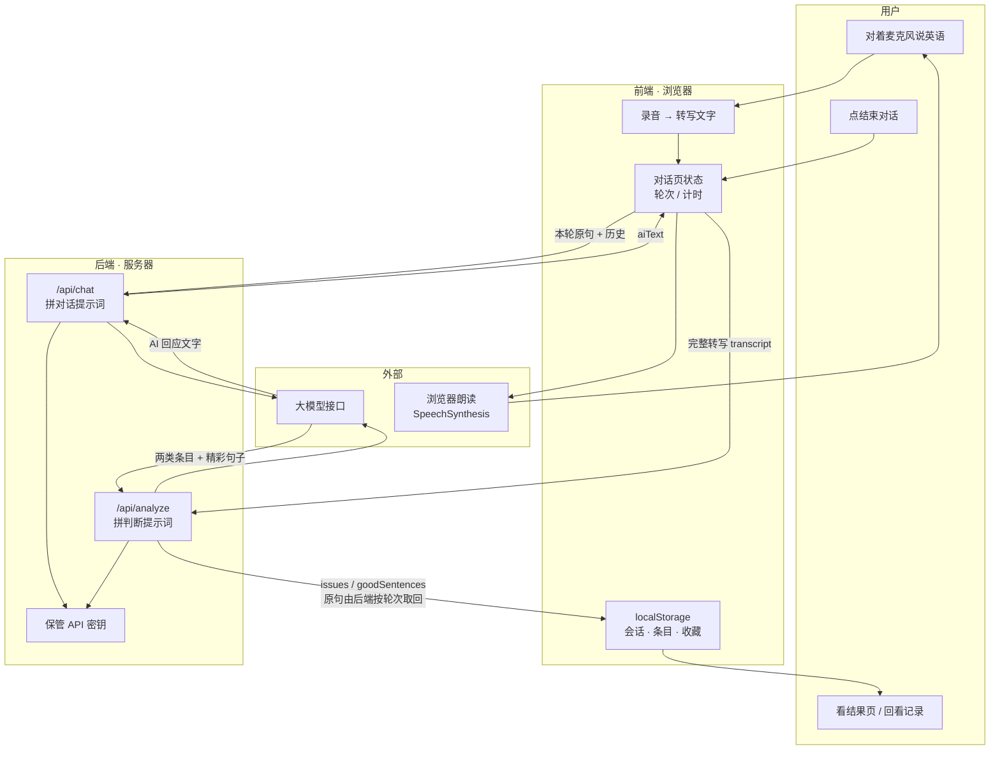

# 口语对话实战器 · 技术设计文档（TECH_DESIGN.md）

**项目：口语对话实战器**　｜　**版本：v1.0（MVP）**　｜　**阶段：Day 5 / 第 1 周**　｜　**日期：2026-09-20**

> 上游文档：`PRD.md`（Day 4 产出，回答"做什么、做到什么算完成"）。
> 本文档回答"**怎么实现**"——选什么技术、数据怎么流、出错怎么办、怎么上线。
> 本文档**不含代码**。所有技术方案的取舍都能回溯到 `PRD.md` 的对应条款。

---

## 目录

1. [文档信息](#t1)
2. [设计前提与约束](#t2)
3. [技术路线对比与选定](#t3)
4. [项目结构](#t4)
5. [数据对象及字段](#t5)
6. [API 列表](#t6)
7. [数据流](#t7)
8. [错误处理](#t8)
9. [环境变量](#t9)
10. [部署与迁移注意事项](#t10)
11. [待决项与风险](#t11)

---

<a id="t1"></a>

## 一、文档信息

| 项 | 内容 |
|---|---|
| 项目名称 | 口语对话实战器 |
| 文档类型 | 技术设计文档（Technical Design） |
| 版本 | v1.0（与 PRD v1.0 对齐） |
| 阶段 | Day 5 / 第 1 周 |
| 上游 | `PRD.md`（Day 4） |
| 下游 | Day 6 起开发；Day 6 实测校准（见 [11.1](#t11)） |
| 本版选定的技术路线 | **路线乙：前端 + 轻后端 + 浏览器本地存储**（见 [第三节](#t3)） |
| 本文档不含 | 代码、界面视觉稿、AI 提示词的完整措辞 |

### 1.1 本版技术的三条底线

这三条不是技术偏好，而是**从 PRD 的一票否决项倒推出来的**（PRD §9.3 规定：A3 / B3 / B8 / B9 任一不成立即整体不通过）：

| # | 底线 | 来源 | 技术上的含义 |
|---|---|---|---|
| 1 | **数据不能丢** | PRD A3 | 会话记录必须在页面关闭后仍可读（落本地存储，且写入时机在"结束对话"时而非内存里） |
| 2 | **原句不能编造** | PRD B8 | 提醒与纠正里引用的原句，必须**从本次转写文本中原样取出**，不能让 AI 重新生成一遍 |
| 3 | **对话中不能评判** | PRD B9 | 对话过程中的 AI 调用**不携带**偏题/逻辑判断的指令，判断只发生在会话结束后 |

---

<a id="t2"></a>

## 二、设计前提与约束

### 2.1 来自 PRD 的硬约束

| 约束 | 内容 | 对技术设计的影响 |
|---|---|---|
| **单场景 8 主题** | 只做「职场即兴英语对话」，组 A 会议上 5 个 + 组 B 同事间 3 个（PRD §6.3） | 主题可写成一份配置数据，不写死在代码里 |
| **不做账号系统** | D5 已砍，数据存本机；代价记在 R5 | **不引入数据库**，用浏览器 localStorage |
| **不做移动 App** | D6 已砍，网页形态 | 只做响应式网页，不做打包上架 |
| **单次 3–5 分钟** | PRD §3.4 | 单次会话的 AI 调用轮数可控，成本可估算 |
| **本机存储会丢** | R5：换设备、清缓存、换浏览器都会丢 | 必须在界面上明确告知"数据只存在本机"，并尽量降低误清风险 |
| **语音识别可能不准** | R1：转写错，提醒与纠正都会指错 | 识别方案要**可替换**，且转写文字要让用户能回看比对 |

### 2.2 面向"零基础、28 天、一个人"的约束

| 约束 | 具体 |
|---|---|
| **作者基础** | 零基础，边学边做；技术选型优先选"报错能看懂、搜得到中文答案"的方案 |
| **时间** | 28 天总量（PRD 已完成，开发从 Day 6 起算，约 3 周） |
| **形态** | 网页，一条链接就能给第 4 周的 2 位试用者 |
| **不做** | 不写课程体系、不做游戏化、不做多场景（见 PRD §5.2 的 13 项砍掉清单） |

### 2.3 这里说明一件事：为什么是"轻后端"而不是"纯前端"

一句话：**密钥不能放在网页里，识别方案要能换。** 完整论证见 [3.3](#t3)。

---

<a id="t3"></a>

## 三、技术路线对比与选定

### 3.1 三条候选路线

| 路线 | 构成 | 一句话 |
|---|---|---|
| **甲** | 纯前端 | 全部交给浏览器，AI 接口由浏览器直接调用 |
| **乙** ⭐ | 前端 + 轻后端 + 浏览器本地存储 | 浏览器只管界面与录音，AI 调用走后端 |
| **丙** | 前端 + 后端 + 云端数据库 | 再加数据上云、账号同步 |

### 3.2 五维度对比

| 维度 | **甲｜纯前端** | **乙｜前端+轻后端** ⭐ | **丙｜前端+后端+云端数据库** |
|---|---|---|---|
| **学习成本** | 最低，只需 HTML/CSS/JS，约 2–3 天上手 | 中，多学 Node.js 一个小文件（约 30–50 行）+ 环境变量概念，多花 2–3 天 | 最高，还要学数据库、表结构、SQL、数据隔离，多花 1.5–2 周 |
| **线上持久化** | 代码可上云分享，**数据留在浏览器** | 同甲：**数据留在浏览器**，App 代码可上云分享 | 数据真上云、可跨设备同步（需账号） |
| **费用** | AI 调用费 + 静态托管（免费额度够用） | 同甲，加后端托管（Vercel/Render 免费额度够用）。三档实际总花销差别不大，主要成本都是 AI 调用费 | 同乙，加数据库（Supabase 免费档够用） |
| **排错难度** | **最难查**：只能看到浏览器侧报错，AI 那边发生了什么看不到；密钥还想藏，出问题更难定位 | **最好查**：后端能打日志，能看到"发了什么、AI 回了什么"，出错定位快 | 最复杂：前端→后端→数据库→AI 四段链路，一处不通可能要四层都查 |
| **转写准确率**（注） | 用浏览器原生 Web Speech API，对带口音的英语识别一般，Chrome 上还依赖网络 | **可换更强的识别服务**（同样走后端中转），准确率上限更高 | 同乙 |
| **API 密钥安全** | ❌ 暴露，任何访客 F12 可见并可盗用（费用由作者承担） | ✅ 锁在后端 | ✅ 锁在后端 |
| **与 PRD 的冲突** | 无 | 无 | ⚠️ 与 D5（砍掉账号系统）冲突 |
| **Day 6 起工作量** | 少 | 中 | 大，会挤占 F2 判断逻辑的时间 |

> **注（此处为本文档新增的第 5 个维度）**：用户交办的对比要求是"学习成本、线上持久化、费用、排错难度"四项。**"转写准确率"是本文档主动加入的第五项**——依据是 PRD §10.2 R1（语音识别不准"直接击穿 B8、损害信任"）与 `research.md` §9-1（Day 5 须评估识别方案）。因为它是产品能否成立的前提，不是可选项。

### 3.3 选定：路线乙（前端 + 轻后端 + 浏览器本地存储）

**三条理由，每条都对应 PRD 里的既有条款：**

| # | 理由 | 依据 |
|---|---|---|
| 1 | **保护密钥与成本** | PRD R2 已登记"砍掉付费后成本全部自担"。甲把密钥公开在网页源码里，等于把作者的 AI 账单挂在公网上；乙用一个约 30–50 行的后端文件堵住这个口子，是投入产出比最高的一次防御 |
| 2 | **R1 需要"能换识别方案"的自由度** | PRD R1 要求评估识别方案，B8 又要求"每条提醒都引用用户真实说过的原句"且属一票否决。浏览器原生识别对带中文口音的英语准确率不稳，纯前端会被浏览器能力绑死——**一旦识别不准就无路可退**；走后端才留有替换空间 |
| 3 | **丙被 PRD 明确排除** | D5 已砍掉账号系统，R5 明确接受"数据只存在本机"。选丙等于把砍掉的账号系统加回来，属于"回头大改 PRD" |

**为什么这条路线不算"过度设计"**：乙与甲的差别只是**多一个后端文件**，不是学一套后端架构。它没有引入数据库、没有引入框架、没有引入构建工具，仍然是"一个网页 + 一个小服务"。

**关于升级路径（诚实说明代价）**：丙不是被永久否决。乙可以平滑升级为丙——将来若要让记录跨设备同步，只需加一个云数据库并保留后端，前端代码基本不用改。**现在选乙不等于以后做不了，只是不提前付那 1.5 周。**

**如果卡住怎么办（降级方案）**：按今日任务清单的「卡住降级」条款，若 Day 6–8 实测发现后端确实无法推进，降级为**路线甲（纯前端）**继续走通链路，但必须同时接受两条代价并在文档中记录：
- 密钥暴露 → 只能使用**额度极小、随时可撤销**的临时 Key，且不上线公开链接（改为仅本地/私密试用）
- 识别方案锁死在浏览器 → R1 的风险只能靠"让用户回看转写文字自行比对"缓解，B8 的保障力度下降

> 降级是**不得已的选择**，不是等价替代。写在这里是为了万一卡住时有明确去处，而不是给提前放弃留后门。

### 3.4 技术栈清单（选定后的具体选型）

| 层 | 选什么 | 为什么选它 | 备选与代价 |
|---|---|---|---|
| **前端界面** | 原生 HTML + CSS + JavaScript（不用框架） | 零基础最快看到结果；无需学构建工具、无需 npm 打包；改完刷新即可见。PRD 只有 4 个页面，框架带来的收益小于学习成本 | React/Vue：生态好、组件化，但要学构建工具与语法，多花 1 周以上，本期不划算 |
| **语音转文字（转写）** | 浏览器原生 Web Speech API（`SpeechRecognition`），作为 v1 首选 | 零成本、零配置、无需额外调用费；**v1 先用它把链路跑通**，符合"先验证"的目标 | 云端识别服务（如讯飞、Azure、OpenAI）：准确率与口音鲁棒性更好，但多一笔费用、多一处密钥、多一点延迟。**是否切换由 Day 6 实测决定（Q-T1）** |
| **文字转语音（AI 开口）** | 浏览器原生 `SpeechSynthesis` | 同上：零成本、零配置，能出声即可满足"回应有文字 + 语音"（B2） | 云端 TTS：音色更自然、更像真人，但要钱且要密钥。**Day 6 实测后决定（Q-T2）** |
| **AI 对话与判断** | 通过后端调用大模型接口（文本对话） | 对话与判断是产品核心，必须用真实大模型；走后端可保护密钥 | 无（这是必须项，不存在"不用"的选项） |
| **后端** | Node.js（单文件，约 30–50 行），只做"转发 + 保管密钥" | 浏览器环境已装 Node；一个文件即可运行；与前端同为 JavaScript，**不用再学第二门语言** | Python（FastAPI/Flask）：同样可行，但要额外学一门语言的环境配置。**对零基础，同语言的成本更低** |
| **数据存储** | 浏览器 localStorage | 零配置、零费用、满足 A3（关掉再打开数据还在）；对应 D5 砍掉账号后的方案（R5） | 云数据库：能跨设备，但要账号、要表结构、要数据隔离，与 D5 冲突 |
| **托管（部署）** | 前端静态托管 + 后端托管（具体平台见 [第十节](#t10)） | 都提供免费额度，一条链接即可分享 | 自建服务器：要买机器、配环境、管进程、配域名证书，本期不可行 |

> **本节的取舍原则**：凡是"能用浏览器原生能力解决的，先不引入外部服务"。理由是本期要验证的是**产品假设（H1–H3），不是技术架构**（PRD §4.1）。技术复杂度每多一层，就少吃一天的开发时间。

---

<a id="t4"></a>

## 四、项目结构

### 4.1 目录结构

```
vibecoding/                        ← 仓库根目录（当前工作区）
├── PRD.md                         ← 【Day 4 已有】产品需求文档
├── research.md                    ← 【Day 3 已有】需求研究
├── TECH_DESIGN.md                 ← 【Day 5 新增】本文档
├── AGENTS.md                      ← 【已有】协作规则
├── README.md                      ← 【Day 7 新增】运行说明（怎么把页面跑起来）
│
├── frontend/                      ← 【Day 7 起新增】前端，可单独部署
│   ├── pages/
│   │   ├── topics.html            ← P1 主题列表页（含昵称输入）
│   │   ├── dialogue.html          ← P2 对话页
│   │   ├── result.html            ← P3 会话结果页
│   │   └── records.html           ← P4 错误记录页
│   ├── js/
│   │   ├── speech.js              ← 录音与转写、AI 语音播放
│   │   ├── api.js                 ← 统一封装对后端的请求（唯一出口）
│   │   ├── storage.js            ← localStorage 读写（唯一出口）
│   │   └── pages/                 ← 每个页面各自的逻辑
│   │       ├── topics.js
│   │       ├── dialogue.js
│   │       ├── result.js
│   │       └── records.js
│   ├── styles/
│   │   └── main.css               ← 全站样式
│   └── data/
│       └── topics.json            ← 8 个主题的配置（内容，不是机制）
│
├── backend/                       ← 【Day 6 起新增】后端，独立部署
│   ├── server.js                  ← 唯一入口：托管静态文件 + 提供 API
│   ├── routes/
│   │   ├── chat.js                ← 对话轮次接口
│   │   └── analyze.js             ← 会话结束后的判断接口
│   ├── prompts/
│   │   ├── dialogue.js            ← 对话方人设与"不迁就"三条硬规则
│   │   └── analysis.js            ← 偏题/逻辑两类判断的指令
│   ├── services/
│   │   └── llm.js                 ← 调用大模型（密钥只在这里出现）
│   ├── .env                       ← 环境变量（**绝不提交**）
│   ├── .env.example               ← 变量名单（**要提交**，给人看要填什么）
│   └── .gitignore                 ← 确保 .env 不进仓库
│
└── docs/
    └── dfd-data-flow.md           ← 数据流图的可复制源码（Mermaid 全文）
```

### 4.2 结构上的三条规矩

| # | 规矩 | 为什么 |
|---|---|---|
| 1 | **`api.js` 是前端访问后端的唯一出口** | 将来换后端地址、加统一错误处理，只改一个文件；也便于排查"到底发出去了没有" |
| 2 | **`storage.js` 是 localStorage 的唯一出口** | 将来若升级到云端数据库（路线丙），只需改这一个文件，4 个页面不用动 |
| 3 | **密钥只在 `backend/.env` 出现，前端永不出现** | 这是选路线乙的全部意义所在（[3.3](#t3)） |

> **说明（Day 5 原文）**：完整目录里 `frontend/`、`backend/`、`docs/` 都是**计划中**的结构，Day 5 不创建（今日不写代码）。
>
> **说明（Day 7 修订）**：根目录原有的 `index.html`（Day 2 占位页）**已于 Day 7 移除**——它的角色（P1 首页）已由 `frontend/pages/topics.html` 承接，两处并存会造成"两个首页"。入口统一为 `frontend/pages/topics.html`。被删文件仍可在 Git 历史里找回（commit `9a82f2c`）。`backend/` 与 `docs/` 仍未创建，`frontend/` 已按本表结构落地。

---

<a id="t5"></a>

## 五、数据对象及字段

### 5.1 数据模型总览

四张"表"（localStorage 里就是四个键）：

```
topics（主题配置·只读，来自 topics.json）
   │
   │ 1 : N
   ▼
sessions（会话）
   │
   ├── 1 : N ──> turns（轮次）
   │
   └── 1 : N ──> issues（问题条目）── 收藏与备注挂在这里
```

### 5.2 表一：`topics`　主题配置（只读）

来源：`frontend/data/topics.json`，**不是用户数据**，只在代码里维护。

| 字段 | 类型 | 说明 | 示例 |
|---|---|---|---|
| `topicId` | string | 主题编号，F3 的 8 个主题之一 | `"T1"` |
| `group` | string | 分组，对应 PRD 的两个组标题 | `"会议上"` / `"同事间"` |
| `name` | string | 主题名 | `"项目进度被追问"` |
| `summary` | string | 一句话说明（卡片上显示） | `"What's the status? Why the delay?"` |
| `durationLabel` | string | 预计时长（本版统一 3–5 分钟，见 PRD §6.3） | `"3–5 分钟"` |
| `opening` | string | AI 的第一句（每个主题不同，禁止万能开场） | `"We're a bit behind. So, what's the status?"` |
| `followUps` | string[] | 会被追问什么（3 条，即兴压力的来源） | `["具体哪一步没做完","原因是什么","什么时候能好"]` |
| `anchor` | string | **偏题判定锚点**：什么算跑题，同时也是追问边界 | `"说了进度却给不出原因或时间点"` |

> `anchor` 有双重作用（PRD §6.3）：既给 [t6](#t6) 的 `/api/analyze` 判断偏题用，也给 `/api/chat` 限定追问范围用。

### 5.3 表二：`sessions`　会话（一次练习 = 一条）

| 字段 | 类型 | 说明 | 对应 PRD |
|---|---|---|---|
| `sessionId` | string | 会话唯一标识 | §8.4 会话 ID |
| `nickname` | string | 昵称；未填写时为 `""`，界面用"你"称呼 | 字段① |
| `topicId` | string | 本次练的主题 | §8.4 主题 ID |
| `startedAt` / `endedAt` | string | 起止时间（ISO 8601） | §8.4 时间戳 |
| `durationSeconds` | number | **对话时长**（墙钟时间，从第一次发言到点"结束对话"，含停顿与 AI 说话时间） | 字段②　PRD §8.2 |
| `errorCount` | number | **错误次数** = 偏题条数 + 逻辑错误条数 | 字段③　PRD §8.3 |
| `goodSentenceCount` | number | **精彩句子呈现次数** = 精彩句子区的条数 | 字段④　PRD §8.2 |
| `turnCount` | number | 总轮数（一轮 = 用户一次发言 + AI 一次回应） | §8.4 轮次 |
| `transcript` | object[] | 转写全文（见下） | §8.4 转写全文 |
| `isComplete` | boolean | 是否正常结束（中途退出也存，见 B6） | B6 |

**`transcript` 里每一项的结构**（数组，按轮次顺序）：

| 字段 | 类型 | 说明 |
|---|---|---|
| `turn` | number | 第几轮 |
| `userText` | string | 用户原句（一字不改，B8 的唯一可信来源） |
| `aiText` | string | AI 的回应文字 |
| `timestamp` | number | 相对会话开始的毫秒数（用于回放与排序） |

### 5.4 表三：`turns`　轮次

> **实现说明**：为减少读写次数、避免数据不一致，v1 **把轮次作为 `sessions.transcript` 数组内嵌**，不单独立表。下表是它的字段定义（逻辑上仍是独立实体）。

| 字段 | 类型 | 说明 |
|---|---|---|
| `turn` | number | 轮次序号，从 1 开始 |
| `userText` | string | 用户原句 |
| `aiText` | string | AI 回应文字（前端再用 `SpeechSynthesis` 读出来，B2） |
| `timestamp` | number | 该轮开始的相对时间（毫秒） |
| `askedFollowUp` | boolean | 本轮 AI 是否做了追问（用于 Day 6 校准追问触发） |

### 5.5 表四：`issues`　问题条目（偏题 / 逻辑错误）

这是 F2、F4、F5 共用的核心结构（PRD §6.2 的"一条条目长什么样"）。

| 字段 | 类型 | 说明 | 偏题条目 | 逻辑错误条目 |
|---|---|---|---|---|
| `issueId` | string | 条目唯一标识 | 必有 | 必有 |
| `sessionId` | string | 所属会话 | 必有 | 必有 |
| `topicId` | string | 所属主题 | 必有 | 必有 |
| `type` | string | 类型，只允许两个值 | `"off_topic"` | `"logic_error"` |
| `turn` | number | 出现在第几轮 | 必有 | 必有 |
| `originalText` | string | **用户原句**，从 `transcript[].userText` 原样取出 | 必有 | 必有 |
| `reminder` | string | 提醒：偏题→说明偏离了主题哪一点；逻辑错→说明哪里不成立 | 必有 | 必有 |
| `correction` | string | **纠正：应该怎么说** | **必须为 `null`**（偏题不给改法，B7） | **必须有值**（只理顺说法，不改用户意思） |
| `isFavorited` | boolean | 收藏标记（F4） | 默认 `false` | 默认 `false` |
| `note` | string | 备注（单行短文本，建议 ≤30 字） | 默认 `""` | 默认 `""` |
| `favoritedAt` | string \| null | 收藏时间，用于收藏区倒序排列（F4） | — | — |
| `createdAt` | string | 条目生成时间，用于记录页时间倒序（B19） | 必有 | 必有 |

> **为什么把 `type` 限制为两个值**：PRD §5.2 D13 砍掉了「表达可简化」类建议。类型只有两种，`errorCount` 才能等于两类条目数之和（B22 逐条核对）。

### 5.6 表五：`goodSentences`　精彩句子

| 字段 | 类型 | 说明 |
|---|---|---|
| `sentenceId` | string | 唯一标识 |
| `sessionId` | string | 所属会话 |
| `turn` | number | 出现在第几轮 |
| `originalText` | string | 用户原句（**不含 AI 说的句子**，PRD §8.1 字段④口径） |
| `isFavorited` / `note` | — | 同 `issues`，精彩句子也能收藏（PRD §6.4） |

### 5.7 localStorage 的键与状态标记

| 键名 | 存什么 | 何时写 |
|---|---|---|
| `vibecoding.nickname` | 昵称字符串 | 用户在首页填完时 |
| `vibecoding.sessions` | `sessions` 数组 | **点"结束对话"时**（关键：不是中途写，避免半截数据） |
| `vibecoding.issues` | `issues` 数组 | 会话结束后拿到判断结果时 |
| `vibecoding.goodSentences` | `goodSentences` 数组 | 同上 |
| `vibecoding.schemaVersion` | 数字，当前 `1` | 首次运行时写入 |

> **主题的"上次在这里卡过"标记**（PRD §6.3）**不单独存**：它由 `issues` 里是否出现过该 `topicId` 实时算出，避免两处状态不同步。

---

<a id="t6"></a>

## 六、API 列表

### 6.1 接口总览

只有 **3 个**接口。**判断逻辑（偏题 / 逻辑）与对话逻辑是两条独立的路**，这是 B9（对话中不评判）在接口设计上的落地。

| # | 方法 | 路径 | 用途 | 对应功能 |
|---|---|---|---|---|
| 1 | `POST` | `/api/chat` | 用户说了一句 → AI 回一句 | F1 |
| 2 | `POST` | `/api/analyze` | 整场结束后 → 一次性给出两类条目 + 精彩句子 | F2 |
| 3 | `POST` | `/api/speech-to-text` | （**预留，v1 默认不用**）服务端转写 | F1 / R1 备选 |

> 主题配置（`topics.json`）**不需要接口**——它是静态文件，前端直接读。收藏、备注、记录查询**也不需要接口**——它们只读写 localStorage（见 [5.7](#t5)）。

### 6.2 `POST /api/chat`

**请求**

```json
{
  "topicId": "T1",
  "history": [
    { "turn": 1, "userText": "We are a bit behind on the API.", "aiText": "Okay. Which part exactly?" }
  ],
  "userText": "The backend part. I think we can finish it.",
  "silenceSeconds": 0
}
```

| 字段 | 必填 | 说明 |
|---|---|---|
| `topicId` | 是 | 用于取该主题的 `opening` / `followUps` / `anchor` |
| `history` | 是 | 已有轮次（**只传文本**，不传音频），用于保持上下文连贯 |
| `userText` | 是 | 用户本轮说的话（转写结果） |
| `silenceSeconds` | 否 | 用户上一轮前的沉默秒数；大于约定值（PRD 暂定 8 秒）时，后端在回应前先加一句催促（F1、B5） |

**响应（成功）**

```json
{
  "ok": true,
  "aiText": "Finish it by when?",
  "kind": "follow_up",
  "followUpType": "vague"
}
```

| 字段 | 说明 |
|---|---|
| `aiText` | AI 要说的那句话（前端同时显示文字 + 朗读出声，B2） |
| `kind` | 三类之一：`"normal"`（正常回应）/ `"follow_up"`（追问）/ `"nudge"`（催促） |
| `followUpType` | `key` 为 `follow_up` 时才有值：`"too_short"`（说得太短）/ `"vague"`（说得含糊）/ `"incomplete"`（说到一半停住，**不替他补完**）——对应 PRD §6.1 三类触发 |

**响应（失败）**

```json
{ "ok": false, "errorCode": "LLM_TIMEOUT", "message": "AI 没有及时回应" }
```

**这一接口的硬约束**（写进后端提示词，属于不可放宽项）：

1. 提示词里**不得出现**偏题 / 逻辑判断的指令，也不得输出任何评价性结论 → 保证 B9
2. 必须携带 PRD §6.1 的三条硬规则：不主动降语速不简化用词、不替用户补完、不无条件肯定
3. 追问方向**只允许落在该主题的 `anchor` 与 `followUps` 范围内**

### 6.3 `POST /api/analyze`

**请求**

```json
{
  "topicId": "T1",
  "transcript": [
    { "turn": 1, "userText": "We are a bit behind on the API.", "aiText": "Okay. Which part exactly?" }
  ]
}
```

**响应（成功）**

```json
{
  "ok": true,
  "issues": [
    {
      "type": "logic_error",
      "turn": 2,
      "originalText": "We have some issues but I think it's ok.",
      "reminder": "先说\"有问题\"又说\"没问题\"，前后不一致",
      "correction": "We're two days behind on the API, but we can still make Friday."
    },
    {
      "type": "off_topic",
      "turn": 3,
      "originalText": "By the way, I really like the coffee here.",
      "reminder": "这一句偏离了\"解释进度和原因\"这个主题",
      "correction": null
    }
  ],
  "goodSentences": [
    { "turn": 2, "originalText": "We're two days behind because the API spec changed." }
  ],
  "noIssueFound": false
}
```

| 字段 | 说明 |
|---|---|
| `issues[].type` | 只允许 `"off_topic"` / `"logic_error"` 两个值 |
| `issues[].correction` | **偏题条目必须为 `null`**；逻辑错误条目必须有值（B7） |
| `issues.length` | 前端据此算出 `errorCount`（B22 要能对上） |
| `goodSentences[].originalText` | 只含用户说的句子，不含 AI 的 |
| `noIssueFound` | 为 `true` 时界面显示"本次没有发现偏题或逻辑错误"，**不硬凑条目**（B10） |

**这一接口的两条硬约束**：

1. **`originalText` 必须从请求的 `transcript[].userText` 原样取出**，禁止由模型重新生成——这是 B8 的技术保障。实现方式：让模型只返回 `turn` 编号，**原文由后端按编号从 `transcript` 里取回**，模型碰不到原句字符串
2. **偏题条目若返回了 `correction`，后端强制置为 `null`**（不依赖模型自觉），保证偏题只提醒不纠正

### 6.4 `POST /api/speech-to-text`（预留）

| 项 | 说明 |
|---|---|
| 用途 | 若 Day 6 实测发现浏览器原生识别对带口音英语准确率不足（R1），把转写改到服务端 |
| v1 状态 | **不启用**。接口位置预留，前端 `speech.js` 里留一个开关 |
| 请求 | 音频文件（`multipart/form-data`） |
| 响应 | `{ "ok": true, "text": "..." }` |
| 代价 | 多一笔按量费用 + 多一份密钥 + 多一段网络延迟 |

---

<a id="t7"></a>

## 七、数据流

### 7.1 一张图：数据从哪来、到哪去



### 7.2 四条数据流的落点

| # | 流 | 从哪 | 到哪 | 关键点 |
|---|---|---|---|---|
| **1** | **说话 → 文字** | 麦克风 | 屏幕上的转写 | 浏览器本地完成，**不出设备**（v1） |
| **2** | **文字 → AI 回应** | 前端 | 后端 → 大模型 → 后端 → 前端 | 只传**文字**，不传音频；密钥全程在后端 |
| **3** | **整场 → 两类条目** | 前端（完整转写） | 后端 → 大模型 → 后端 | **只在结束对话后发生一次**（B9）；原句由后端按轮次从转写取回（B8） |
| **4** | **条目 → 长期保存** | 后端返回的结果 | localStorage | 关掉页面再打开仍在（A3） |

### 7.3 关键时机：什么时候写数据

| 时机 | 写什么 | 为什么是这个时候 |
|---|---|---|
| 填完昵称 | `vibecoding.nickname` | 用户明确动作，不会误写 |
| 点"结束对话" | `sessions`（含 `durationSeconds`、`turnCount`、`transcript`） | **一次性写入完整数据**，避免中途产生半截记录 |
| `/api/analyze` 返回后 | `issues`、`goodSentences`，并回填该会话的 `errorCount` / `goodSentenceCount` | 这两个字段的值来自判断结果，拿到才写 |
| 点收藏 / 写备注 | 更新对应条目的 `isFavorited` / `note` / `favoritedAt` | 立即写，保证"刷新后仍在"（B17） |

> **中途退出怎么办**（B6 要求记录不丢）：用户在对话中途关掉页面时，`/api/analyze` 还没被调用。处理方式是**在"结束对话"按钮上就写 `sessions`，再异步请求判断**；若用户直接关页面没点结束，则该次练习不落库——这一点在上线前如实告知试用者（与 R5 的"数据只存在本机"一并说明）。

### 7.4 数据不出设备的部分（隐私边界）

| 数据 | 是否离开用户设备 |
|---|---|
| 录音音频 | v1 **不离开**（浏览器本地转写后即丢弃） |
| 转写文字 | **离开**（要发给大模型才能对话与判断） |
| 昵称 | **不离开**（只存本地，不发送） |
| 会话记录、收藏、备注 | **不离开**（只存 localStorage） |

---

<a id="t8"></a>

## 八、错误处理

### 8.1 错误处理的总原则

> **任何一层出错，都不能让用户以为"是我说错了"。**

理由：目标用户的核心心理是"怕被评价、认为自己英语差"（PRD §3.1）。技术故障如果表现成"没反应"或"看起来像我的问题"，会直接强化这个错误认知，与产品立足点相反。

### 8.2 错误清单与对策

| # | 错误 | 现象 | 用户看到什么 | 技术对策 |
|---|---|---|---|---|
| **E1** | **麦克风未授权** | 按了"开始说话"没反应 | 一句明确提示："需要允许使用麦克风，点浏览器地址栏的小锁可以开启"，并附一句话说明 | 调用前先检查权限，权限被拒时立即提示，不进入对话状态 |
| **E2** | **转写没出结果** | 说完了，屏幕上没有文字 | 提示"这句话没听清，再说一次好吗"，**并保留本轮不计入** | 转写结果为空时不上屏、不推进轮次；提示后重新进入录音状态 |
| **E3** | **转写明显不准** | 文字与用户说的不一样 | 转写文字**允许用户直接编辑修改**后再发送 | 转写区做成可编辑文本框（这同时是 R1 的缓解措施：让用户能纠正比对的基准） |
| **E4** | **AI 接口超时** | 用户说完，AI 迟迟不回 | 提示"AI 没及时回应，正在重试"，超过约定时间后可手动重试 | 设置超时（建议 20 秒）；**只重试 1 次**，避免重复扣费（R2） |
| **E5** | **接口返回格式不对** | 后端拿到的 JSON 缺字段 | 对话不中断，AI 这一轮留空并提示"这一句没回应上" | 后端对模型返回做结构校验，不合格就重试一次；仍不合格则降级为一句通用回应 |
| **E6** | **判断结果里出现偏题的纠正** | 偏题条目里带了"应该说成…" | 用户看不到（在源头拦掉） | 后端**强制**把偏题条目的 `correction` 置为 `null`（[6.3](#t6)），不依赖模型自觉 |
| **E7** | **判断结果引用了不存在的原句** | 提醒里出现用户没说过的话 | 该条目**不显示** | 后端按 `turn` 从 `transcript` 取回原句；查不到对应轮次就丢弃该条目（B8 的技术保障） |
| **E8** | **localStorage 写满 / 不可用** | 记录存不进去（无痕模式、配额满） | 明确提示："本次记录没能保存——浏览器隐私模式可能不支持"，**功能继续可用** | 写入前后各校验一次；失败不清空已有数据，只提示 |
| **E9** | **localStorage 数据损坏** | 打开记录页空白或报错 | 显示空状态文案（B20 的要求），不显示报错堆栈 | 读取时做 try/catch + JSON 解析校验；解析失败时按空数据渲染，并保留原数据不覆盖 |
| **E10** | **AI 回应了但没声音** | 有文字，没声音 | 文字正常显示；播放区显示"点这里重听" | `SpeechSynthesis` 失败时降级为纯文字，**不阻塞对话**（B2 要求有文字+语音，语音失败时至少文字可用） |
| **E11** | **用户沉默过久** | 页面一直静默 | 出现一句催促（B5） | 前端计时到约定秒数（PRD 暂定 8 秒）触发 `silenceSeconds` 参数，由后端生成催促话术 |

### 8.3 三类错误的不同处置强度

| 类型 | 例子 | 处置 |
|---|---|---|
| **阻断型**（做不下去） | E1 麦克风未授权、E4 接口超时 | 明确提示 + 给出下一步动作（怎么开权限 / 怎么重试） |
| **降级型**（能继续但少一块） | E10 没声音、E5 格式不对 | 保持主流程可用，缺的那一块给替代方式 |
| **静默型**（不能给用户看到） | E6 偏题的纠正、E7 编造原句 | 在源头丢弃或修正，**不告诉用户**（否则反而暴露 AI 出错过，损害信任，违反 B8 的意图） |

---

<a id="t9"></a>

## 九、环境变量

### 9.1 变量清单

只有后端需要环境变量。**`.env` 绝不提交，`.env.example` 要提交。**

| 变量名 | 必填 | 说明 | 示例（**假值**） | 在哪用 |
|---|---|---|---|---|
| `LLM_API_KEY` | ✅ 是 | 大模型接口的密钥。**整个项目唯一需要保密的东西** | `sk-xxxxxxxxxxxxxxxx` | `backend/services/llm.js` |
| `LLM_BASE_URL` | ✅ 是 | 模型接口地址（换供应商时只改这里） | `https://api.example.com/v1` | 同上 |
| `LLM_MODEL` | ✅ 是 | 用哪个模型（对话与判断可以分别指定） | `gpt-4o-mini` | 同上 |
| `LLM_MODEL_ANALYZE` | 否 | 判断用模型，不填则同 `LLM_MODEL` | `gpt-4o` | `backend/routes/analyze.js` |
| `PORT` | 否 | 后端监听端口，默认 `3000` | `3000` | `backend/server.js` |
| `SILENCE_SECONDS` | 否 | 沉默多久触发催促，默认 `8`（PRD §6.1 暂定值，Q2 待实测定稿） | `8` | `backend/routes/chat.js` |
| `MAX_RETRY` | 否 | 接口失败重试次数，默认 `1`（**不要调大**，避免重复扣费，R2） | `1` | `backend/services/llm.js` |

### 9.2 密钥安全的三条硬规矩

| # | 规矩 | 说明 |
|---|---|---|
| 1 | **密钥只出现在 `backend/.env`** | 前端任何文件、GitHub 仓库、聊天记录里都不能出现 |
| 2 | **`.env` 必须进 `.gitignore`** | `backend/.gitignore` 第一行就是 `.env`；提交前应能看到 `.env` 不在改动清单里 |
| 3 | **密钥泄露后的处置** | 立即到模型供应商后台**撤销该 Key 并新建一个**（只删文件是不够的，已泄露的 Key 仍然有效） |

### 9.3 一条来自实践的提醒

你目前用的是**沙箱执行环境**，`.env` 文件在本机是真实存在的。按 `AGENTS.md` 五.3 的规定，**密钥、`.env`、连接串永远不进代码、不进提交**——这一点在 Day 6 建 `backend/` 时就先把 `.gitignore` 写好，不要等写完代码再补。

---

<a id="t10"></a>

## 十、部署与迁移注意事项

### 10.1 部署什么、部署到哪

| 部分 | 部署到哪 | 为什么 |
|---|---|---|
| **前端**（4 个页面 + JS + CSS + topics.json） | 静态托管（Vercel / Netlify / GitHub Pages 任选其一） | 纯静态文件，免费额度够用，一条链接即可分享给试用者 |
| **后端**（server.js） | 支持 Node.js 的托管平台（Vercel / Render 任选其一） | 需要一个能跑起来并保持在线的地方；免费额度够本期用量 |
| **数据** | **不部署**（在用户自己浏览器的 localStorage 里） | 对应 D5 砍掉账号系统、R5 接受本机存储的代价 |

> **平台选型不在今天定**。Day 5 只确认"前端与后端分开部署"这个结构；具体平台在 Day 6 实测时按"免费额度够不够、报错好不好懂"再定。

### 10.2 部署前的检查清单

| # | 检查 | 为什么 |
|---|---|---|
| 1 | `.env` 不在 Git 仓库里（`git ls-files` 看不到它） | 密钥泄露是本次最严重的部署事故 |
| 2 | 托管平台的环境变量里填了 `LLM_API_KEY` 等 | 后端在服务器上也要能读到密钥 |
| 3 | 前端里没有任何硬编码的密钥或后端地址 | 换环境时只改配置，不改代码 |
| 4 | 后端的 CORS 只允许自己的前端域名访问 | 否则别人可以用你的后端白嫖 AI 调用 |
| 5 | 用户打开的页面能明确看到"数据只存在本机" | R5 要求主动告知，不能等用户发现丢数据 |
| 6 | 在**未登录、全新浏览器**里打开一次链接，走通完整流程 | 模拟第 4 周试用者的真实第一次使用 |

### 10.3 迁移注意事项（什么时候会需要迁移）

| 场景 | 会不会发生 | 要怎么处理 |
|---|---|---|
| **换模型供应商**（如换一家 AI 接口） | 可能 | 只改 `LLM_BASE_URL` / `LLM_MODEL` 两个变量；提示词格式若不同，改 `backend/prompts/` |
| **换识别方案**（浏览器原生 → 云端识别） | 可能（由 R1 决定） | 启用 [6.4](#t6) 预留接口；前端只改 `speech.js` 一个文件 |
| **升级到路线丙（加云端数据库）** | 本期不做，将来可能 | 只需改 `storage.js` 一个文件（结构上已预留，见 [4.2](#t4) 规矩 2） |
| **调整主题内容**（增删主题、改锚点） | 可能（Q4 说主题随时可增删） | 只改 `frontend/data/topics.json`，不动代码 |
| **localStorage 数据结构变化** | 一定会发生（开发过程中） | 用 `vibecoding.schemaVersion` 做版本标记；版本不符时**不要静默覆盖用户数据**，先备份到 `vibecoding.backup.<版本>` 再迁移 |
| **换设备 / 清缓存 / 换浏览器** | **会发生**（R5） | 无法自动解决；只能提前告知用户"数据只存在本机"，试用时用同一浏览器（PRD R5 对策） |

### 10.4 上线前必须实测的三件事

| # | 实测什么 | 依据 | 不通过怎么办 |
|---|---|---|---|
| 1 | **带中文口音的英语，转写准不准** | R1、B8 | 若不准 → 启用云端识别（[6.4](#t6)）；仍不行则降低对原句精确度的承诺，并在结果页让用户能回看转写 |
| 2 | **单次 5 分钟的成本大概多少** | R2 | 若偏高 → 第 4 周试用设时长上限（属操作约定，不做成功能）；**若设了上限，A1 的"5 分钟"标准要同步调整** |
| 3 | **AI 会不会在对话中评判**（B9 一票否决） | B9 | 逐句复查对话提示词，确保不含任何判断指令 |

---

<a id="t11"></a>

## 十一、待决项与风险

### 11.1 本文档留给 Day 6 实测的待决项

| # | 待决内容 | 怎么定 |
|---|---|---|
| **Q-T1** | **转写方案定稿**：浏览器原生够不够，要不要换云端识别 | Day 6 用带口音的长句实测（R1），不过关就启用 [6.4](#t6) |
| **Q-T2** | **AI 语音方案定稿**：浏览器朗读的声音自然度够不够 | Day 6 试听；不够再评估云端 TTS（涉及费用与密钥） |
| **Q-T3** | **判断用哪个模型**：对话与判断是否分开用不同模型 | Day 6 用真实转写跑一遍，看判断质量与成本 |
| **Q-T4** | **沉默催促秒数** | 与 PRD Q2 同一批实测定稿，暂定 8 秒 |
| **Q-T5** | **问题清单一次最多列几条** | 与 PRD Q5 同一批实测定稿，PRD 建议最多前 3 条 |
| **Q-T6** | **部署平台定稿** | Day 6 按"免费额度 + 报错可读性"选一个 |

### 11.2 本文档承接的技术风险

| # | 风险 | 影响 | 技术对策 |
|---|---|---|---|
| **R1** | 语音识别不准 | 击穿 B8、损害信任 | 转写文字可编辑（E3）；识别方案可替换（[6.4](#t6)）；原句由后端从转写取回而非模型生成（E7） |
| **R2** | 语音方案成本高 | 自担成本，可能限制试用次数 | 优先用浏览器原生能力（零成本）；重试次数限制为 1 次（E4）；`MAX_RETRY` 明确不调大 |
| **R5** | 本机存储会丢 | 用户累积记录归零 | 界面明确告知；`schemaVersion` 防止升级时静默清空；数据不跨设备这一点写进试用说明 |
| **R4** | 判断本身出错（误判偏题、错误纠正） | 用户被冤枉，可能记住错的纠正 | 原句必须可溯源（E7）；偏题的纠正强制置空（E6）；判断与对话走两条独立接口 |

> 其余风险（R3 不迁就的分寸、R6 目标用户口径、R7 可准备话题）属**产品话术与实测范围**，由 PRD 第 3 周实测处理，本文档不重复登记。

### 11.3 本文档明确不做的事

| # | 不做 | 依据 |
|---|---|---|
| 1 | 数据库设计、账号系统、数据同步 | D5 |
| 2 | 移动 App 打包上架 | D6 |
| 3 | 前端框架、构建工具（Webpack/Vite 等） | PRD 只有 4 个页面，不必要 |
| 4 | 服务端音频存储 | R1 未要求；音频不出设备更省成本、更好讲隐私 |
| 5 | 发音评分相关的一切 | D1 |

---

## 附录 A｜本文档与 PRD 的对照

| 本文档章节 | 支撑的 PRD 条款 |
|---|---|
| [3.3](#t3) 选定路线乙 | R1、R2、D5、B8 |
| [4.1](#t4) 项目结构 | §7.1 页面清单（P1–P4） |
| [5.3](#t5) `sessions` 四个字段 | §8.1 字段①②③④、§8.2 口径、§8.3 错误次数口径 |
| [5.5](#t5) `issues` 结构 | §6.2 一条条目长什么样、B7、B22 |
| [6.2](#t6) `/api/chat` | §6.1 追问三类触发、三条硬规则、B2–B5 |
| [6.3](#t6) `/api/analyze` | §6.2 两类处理方式、B7–B11 |
| [7.3](#t7) 写入时机 | A3、B6 |
| [8.2](#t8) 错误清单 | B8、B9、B20、R1、R5 |
| [9.1](#t9) 环境变量 | AGENTS.md 五.3（密钥不进仓库） |
| [10.3](#t10) 迁移注意 | R5、Q4 |
| [10.4](#t10) 上线前实测 | R1、R2、B9 |

---

**文档结束。** 本文档为 Day 5 产出。下一步：Day 6 起按本文档开发，并用实测结果回填 [11.1](#t11) 的六个待决项。
