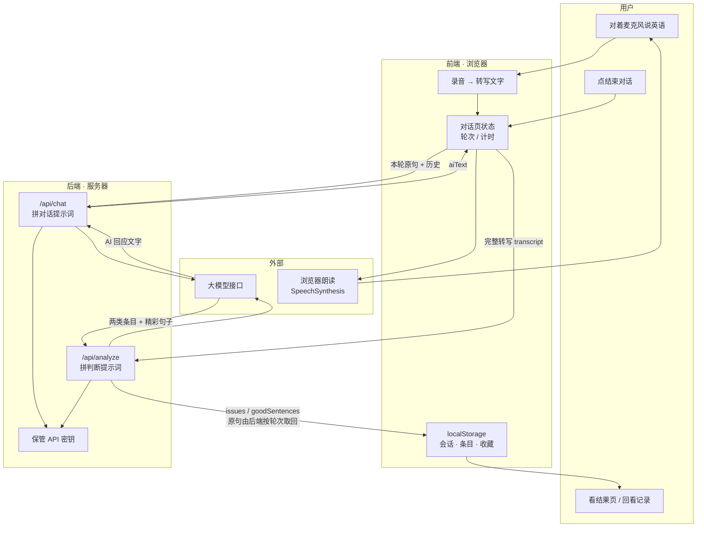

# 口语对话实战器 · 技术设计文档（TECH_DESIGN.md）

**项目：口语对话实战器**　｜　**版本：v1.0（MVP）**　｜　**阶段：Day 5 / 第 1 周**　｜　**日期：2026-09-20**

> 上游文档：`PRD.md`（Day 4 产出，回答"做什么、做到什么算完成"）。
> 本文档回答"**怎么实现**"——选什么技术、数据怎么流、出错怎么办、怎么上线。
> 本文档**不含代码**。所有技术方案的取舍都能回溯到 `PRD.md` 的对应条款。

---

## 目录

1. [文档信息](#t1)
2. [设计前提与约束](#t2)
3. [技术路线对比与选定](#t3)
4. [项目结构](#t4)
   - [4.3 页面之间怎么切换](#t43)　← Day 13 新增
   - [4.4 四种状态的覆盖现状](#t44)　← Day 13 新增
5. [数据对象及字段](#t5)
6. [API 列表](#t6)
7. [数据流](#t7)
8. [错误处理](#t8)
9. [环境变量](#t9)
10. [部署与迁移注意事项](#t10)
11. [待决项与风险](#t11)

---

<a id="t1"></a>

## 一、文档信息

| 项 | 内容 |
|---|---|
| 项目名称 | 口语对话实战器 |
| 文档类型 | 技术设计文档（Technical Design） |
| 版本 | v1.0（与 PRD v1.0 对齐） |
| 阶段 | Day 5 / 第 1 周 |
| 上游 | `PRD.md`（Day 4） |
| 下游 | Day 6 起开发；Day 6 实测校准（见 [11.1](#t11)） |
| 本版选定的技术路线 | **路线乙：前端 + 轻后端 + 浏览器本地存储**（见 [第三节](#t3)） |
| 本文档不含 | 代码、界面视觉稿、AI 提示词的完整措辞 |
| 最近修订 | **Day 13**：新增 §4.3（页面之间怎么切换—— 多页面 + `<a href>` 定稿，附三条选定理由与两条硬规矩）、§4.4（四种状态的覆盖现状盘点与补齐顺序）；**Day 14**：承接 PRD 新增的 F6 自由对话——§4.1（`topics.json` 加一条特殊条目，**不新增文件**）、§5.2/§5.3/§5.7（`FREE` 与 8 个职场主题共用同一套结构）、§6.2/§6.3（自由对话模式下两个接口的差异）、§8.2 E12、§9.1 `FREE_SILENCE_SECONDS`、§11.1 Q-T7；**第 3 步补充**：§5.2 新增 `replyPool` 字段、§5.2.1 补「AI 什么时候取哪一串」与第 4 条约定（**池子里的句子一律英语**）、§6.2 补「8 主题的催促本期也先走本地」；**第 3 步续（补英文追问）**：§5.2 新增 `followUpsEn` 字段、`followUps` 语义收窄为"追问意图"，两者为什么不能合并写在字段表下方；8 个职场主题的英文追问句同步补齐，前端取不到时回退中文 |

### 1.1 本版技术的三条底线

这三条不是技术偏好，而是**从 PRD 的一票否决项倒推出来的**（PRD §9.3 规定：A3 / B3 / B8 / B9 任一不成立即整体不通过）：

| # | 底线 | 来源 | 技术上的含义 |
|---|---|---|---|
| 1 | **数据不能丢** | PRD A3 | 会话记录必须在页面关闭后仍可读（落本地存储，且写入时机在"结束对话"时而非内存里） |
| 2 | **原句不能编造** | PRD B8 | 提醒与纠正里引用的原句，必须**从本次转写文本中原样取出**，不能让 AI 重新生成一遍 |
| 3 | **对话中不能评判** | PRD B9 | 对话过程中的 AI 调用**不携带**偏题/逻辑判断的指令，判断只发生在会话结束后 |

---

<a id="t2"></a>

## 二、设计前提与约束

### 2.1 来自 PRD 的硬约束

| 约束 | 内容 | 对技术设计的影响 |
|---|---|---|
| **单场景 8 主题** | 只做「职场即兴英语对话」，组 A 会议上 5 个 + 组 B 同事间 3 个（PRD §6.3） | 主题可写成一份配置数据，不写死在代码里 |
| **不做账号系统** | D5 已砍，数据存本机；代价记在 R5 | **不引入数据库**，用浏览器 localStorage |
| **不做移动 App** | D6 已砍，网页形态 | 只做响应式网页，不做打包上架 |
| **单次 3–5 分钟** | PRD §3.4 | 单次会话的 AI 调用轮数可控，成本可估算 |
| **本机存储会丢** | R5：换设备、清缓存、换浏览器都会丢 | 必须在界面上明确告知"数据只存在本机"，并尽量降低误清风险 |
| **语音识别可能不准** | R1：转写错，提醒与纠正都会指错 | 识别方案要**可替换**，且转写文字要让用户能回看比对 |

### 2.2 面向"零基础、28 天、一个人"的约束

| 约束 | 具体 |
|---|---|
| **作者基础** | 零基础，边学边做；技术选型优先选"报错能看懂、搜得到中文答案"的方案 |
| **时间** | 28 天总量（PRD 已完成，开发从 Day 6 起算，约 3 周） |
| **形态** | 网页，一条链接就能给第 4 周的 2 位试用者 |
| **不做** | 不写课程体系、不做游戏化、不做多场景（见 PRD §5.2 的 13 项砍掉清单） |

### 2.3 这里说明一件事：为什么是"轻后端"而不是"纯前端"

一句话：**密钥不能放在网页里，识别方案要能换。** 完整论证见 [3.3](#t3)。

---

<a id="t3"></a>

## 三、技术路线对比与选定

### 3.1 三条候选路线

| 路线 | 构成 | 一句话 |
|---|---|---|
| **甲** | 纯前端 | 全部交给浏览器，AI 接口由浏览器直接调用 |
| **乙** ⭐ | 前端 + 轻后端 + 浏览器本地存储 | 浏览器只管界面与录音，AI 调用走后端 |
| **丙** | 前端 + 后端 + 云端数据库 | 再加数据上云、账号同步 |

### 3.2 五维度对比

| 维度 | **甲｜纯前端** | **乙｜前端+轻后端** ⭐ | **丙｜前端+后端+云端数据库** |
|---|---|---|---|
| **学习成本** | 最低，只需 HTML/CSS/JS，约 2–3 天上手 | 中，多学 Node.js 一个小文件（约 30–50 行）+ 环境变量概念，多花 2–3 天 | 最高，还要学数据库、表结构、SQL、数据隔离，多花 1.5–2 周 |
| **线上持久化** | 代码可上云分享，**数据留在浏览器** | 同甲：**数据留在浏览器**，App 代码可上云分享 | 数据真上云、可跨设备同步（需账号） |
| **费用** | AI 调用费 + 静态托管（免费额度够用） | 同甲，加后端托管（Vercel/Render 免费额度够用）。三档实际总花销差别不大，主要成本都是 AI 调用费 | 同乙，加数据库（Supabase 免费档够用） |
| **排错难度** | **最难查**：只能看到浏览器侧报错，AI 那边发生了什么看不到；密钥还想藏，出问题更难定位 | **最好查**：后端能打日志，能看到"发了什么、AI 回了什么"，出错定位快 | 最复杂：前端→后端→数据库→AI 四段链路，一处不通可能要四层都查 |
| **转写准确率**（注） | 用浏览器原生 Web Speech API，对带口音的英语识别一般，Chrome 上还依赖网络 | **可换更强的识别服务**（同样走后端中转），准确率上限更高 | 同乙 |
| **API 密钥安全** | ❌ 暴露，任何访客 F12 可见并可盗用（费用由作者承担） | ✅ 锁在后端 | ✅ 锁在后端 |
| **与 PRD 的冲突** | 无 | 无 | ⚠️ 与 D5（砍掉账号系统）冲突 |
| **Day 6 起工作量** | 少 | 中 | 大，会挤占 F2 判断逻辑的时间 |

> **注（此处为本文档新增的第 5 个维度）**：用户交办的对比要求是"学习成本、线上持久化、费用、排错难度"四项。**"转写准确率"是本文档主动加入的第五项**——依据是 PRD §10.2 R1（语音识别不准"直接击穿 B8、损害信任"）与 `research.md` §9-1（Day 5 须评估识别方案）。因为它是产品能否成立的前提，不是可选项。

### 3.3 选定：路线乙（前端 + 轻后端 + 浏览器本地存储）

**三条理由，每条都对应 PRD 里的既有条款：**

| # | 理由 | 依据 |
|---|---|---|
| 1 | **保护密钥与成本** | PRD R2 已登记"砍掉付费后成本全部自担"。甲把密钥公开在网页源码里，等于把作者的 AI 账单挂在公网上；乙用一个约 30–50 行的后端文件堵住这个口子，是投入产出比最高的一次防御 |
| 2 | **R1 需要"能换识别方案"的自由度** | PRD R1 要求评估识别方案，B8 又要求"每条提醒都引用用户真实说过的原句"且属一票否决。浏览器原生识别对带中文口音的英语准确率不稳，纯前端会被浏览器能力绑死——**一旦识别不准就无路可退**；走后端才留有替换空间 |
| 3 | **丙被 PRD 明确排除** | D5 已砍掉账号系统，R5 明确接受"数据只存在本机"。选丙等于把砍掉的账号系统加回来，属于"回头大改 PRD" |

**为什么这条路线不算"过度设计"**：乙与甲的差别只是**多一个后端文件**，不是学一套后端架构。它没有引入数据库、没有引入框架、没有引入构建工具，仍然是"一个网页 + 一个小服务"。

**关于升级路径（诚实说明代价）**：丙不是被永久否决。乙可以平滑升级为丙——将来若要让记录跨设备同步，只需加一个云数据库并保留后端，前端代码基本不用改。**现在选乙不等于以后做不了，只是不提前付那 1.5 周。**

**如果卡住怎么办（降级方案）**：按今日任务清单的「卡住降级」条款，若 Day 6–8 实测发现后端确实无法推进，降级为**路线甲（纯前端）**继续走通链路，但必须同时接受两条代价并在文档中记录：
- 密钥暴露 → 只能使用**额度极小、随时可撤销**的临时 Key，且不上线公开链接（改为仅本地/私密试用）
- 识别方案锁死在浏览器 → R1 的风险只能靠"让用户回看转写文字自行比对"缓解，B8 的保障力度下降

> 降级是**不得已的选择**，不是等价替代。写在这里是为了万一卡住时有明确去处，而不是给提前放弃留后门。

### 3.4 技术栈清单（选定后的具体选型）

| 层 | 选什么 | 为什么选它 | 备选与代价 |
|---|---|---|---|
| **前端界面** | 原生 HTML + CSS + JavaScript（不用框架） | 零基础最快看到结果；无需学构建工具、无需 npm 打包；改完刷新即可见。PRD 只有 4 个页面，框架带来的收益小于学习成本 | React/Vue：生态好、组件化，但要学构建工具与语法，多花 1 周以上，本期不划算 |
| **语音转文字（转写）** | 浏览器原生 Web Speech API（`SpeechRecognition`），作为 v1 首选 | 零成本、零配置、无需额外调用费；**v1 先用它把链路跑通**，符合"先验证"的目标 | 云端识别服务（如讯飞、Azure、OpenAI）：准确率与口音鲁棒性更好，但多一笔费用、多一处密钥、多一点延迟。**是否切换由 Day 6 实测决定（Q-T1）** |
| **文字转语音（AI 开口）** | 浏览器原生 `SpeechSynthesis` | 同上：零成本、零配置，能出声即可满足"回应有文字 + 语音"（B2） | 云端 TTS：音色更自然、更像真人，但要钱且要密钥。**Day 6 实测后决定（Q-T2）** |
| **AI 对话与判断** | 通过后端调用大模型接口（文本对话） | 对话与判断是产品核心，必须用真实大模型；走后端可保护密钥 | 无（这是必须项，不存在"不用"的选项） |
| **后端** | Node.js（单文件，约 30–50 行），只做"转发 + 保管密钥" | 浏览器环境已装 Node；一个文件即可运行；与前端同为 JavaScript，**不用再学第二门语言** | Python（FastAPI/Flask）：同样可行，但要额外学一门语言的环境配置。**对零基础，同语言的成本更低** |
| **数据存储** | 浏览器 localStorage | 零配置、零费用、满足 A3（关掉再打开数据还在）；对应 D5 砍掉账号后的方案（R5） | 云数据库：能跨设备，但要账号、要表结构、要数据隔离，与 D5 冲突 |
| **托管（部署）** | 前端静态托管 + 后端托管（具体平台见 [第十节](#t10)） | 都提供免费额度，一条链接即可分享 | 自建服务器：要买机器、配环境、管进程、配域名证书，本期不可行 |

> **本节的取舍原则**：凡是"能用浏览器原生能力解决的，先不引入外部服务"。理由是本期要验证的是**产品假设（H1–H3），不是技术架构**（PRD §4.1）。技术复杂度每多一层，就少吃一天的开发时间。

---

<a id="t4"></a>

## 四、项目结构

### 4.1 目录结构

```
vibecoding/                        ← 仓库根目录（当前工作区）
├── PRD.md                         ← 【Day 4 已有】产品需求文档
├── research.md                    ← 【Day 3 已有】需求研究
├── TECH_DESIGN.md                 ← 【Day 5 新增】本文档
├── AGENTS.md                      ← 【已有】协作规则
├── README.md                      ← 【Day 7 新增】运行说明（怎么把页面跑起来）
│
├── frontend/                      ← 【Day 7 起新增】前端，可单独部署
│   ├── pages/
│   │   ├── topics.html            ← P1 主题列表页（含昵称输入）
│   │   ├── dialogue.html          ← P2 对话页
│   │   ├── result.html            ← P3 会话结果页
│   │   └── records.html           ← P4 错误记录页
│   ├── js/
│   │   ├── speech.js              ← 录音与转写、AI 语音播放（**尚未创建**，Day 16 起）
│   │   ├── api.js                 ← 统一封装对后端的请求（唯一出口，**尚未创建**，Day 16 起）
│   │   ├── storage.js             ← 【Day 10 新增】localStorage 读写（唯一出口）
│   │   ├── components/            ← 【Day 8 新增】跨页面复用的 UI 组件
│   │   │   ├── topic-card.js      ← 主题卡片（P1 在用；P4 按主题分组时可直接复用）
│   │   │   ├── item-card.js       ← 【Day 11 新增】条目 + 收藏按钮（P3、P4 在用）
│   │   │   └── interact.js        ← 【Day 11 新增】按钮状态机（星标 / 收藏共用，失败要提示）
│   │   └── pages/                 ← 每个页面各自的逻辑
│   │       ├── topics.js
│   │       ├── dialogue.js        ← **尚未创建**（P2 逻辑目前内联在 dialogue.html）
│   │       ├── result.js          ← **尚未创建**（P3 逻辑目前内联在 result.html）
│   │       └── records.js         ← **尚未创建**（P4 逻辑目前内联在 records.html）
│   ├── styles/
│   │   └── main.css               ← 全站样式
│   ├── data/
│   │   ├── topics.json            ← 主题配置（内容，不是机制）：
│   │   │                             T1–T8 八个职场主题 + 一条 FREE（自由对话，见 §5.2）
│   │   ├── mock-items.json        ← 【Day 11 新增】P3 / P4 的条目与精彩句子（本地假数据）：
│   │   │                             第 3 周接上 /api/analyze 后整体删除
│   │   └── mock-sessions.json     ← 【Day 8 新增】P1「你的卡点」的历次练习概览（本地假数据）
│   ├── regress.js                 ← 【Day 12】四页 × 五断点回归（改 main.css 后的必做项）
│   ├── a11y-check.js              ← 【Day 12】P4 可访问性检查
│   ├── flt-verify.js              ← 【Day 11】P4 筛选验证
│   └── serve.py                   ← 【Day 14 新增】开发用静态服务：每个响应加 no-store
│                                   ←  ⚠️ 以上 4 个自查脚本**不进部署产物**（见下方 Day 15 修订）
│
├── cloudfunctions/                ← 【Day 15 新增】CloudBase 云函数
│   └── health/
│       ├── index.js               ← GET /api/health：只验链路通不通，不连库不调模型
│       ├── package.json           ← 依赖为空（刻意用 Node 原生 http，见 §3.3「零构建」）
│       └── scf_bootstrap          ← 启动脚本，**必须 LF 换行**（CRLF 会起不来）
│
├── cloudbaserc.json               ← 【Day 15 新增】CloudBase 部署配置（v2.1 声明式）：
│                                     envId + functions + hosting + gateway 路由
│
├── backend/                       ← 【Day 6 起新增】后端，独立部署
│   ├── server.js                  ← 唯一入口：托管静态文件 + 提供 API
│   ├── routes/
│   │   ├── chat.js                ← 对话轮次接口
│   │   └── analyze.js             ← 会话结束后的判断接口
│   ├── prompts/
│   │   ├── dialogue.js            ← 对话方人设与"不迁就"三条硬规则
│   │   └── analysis.js            ← 偏题/逻辑两类判断的指令
│   ├── services/
│   │   └── llm.js                 ← 调用大模型（密钥只在这里出现）
│   ├── .env                       ← 环境变量（**绝不提交**）
│   ├── .env.example               ← 变量名单（**要提交**，给人看要填什么）
│   └── .gitignore                 ← 确保 .env 不进仓库
│
└── docs/
    ├── dfd-data-flow.md           ← 数据流图的可复制源码（Mermaid 全文）
    └── api-contract.md            ← 【Day 15 新增】接口契约：第 3 周建表与写接口的唯一依据
```

### 4.2 结构上的三条规矩

| # | 规矩 | 为什么 |
|---|---|---|
| 1 | **`api.js` 是前端访问后端的唯一出口** | 将来换后端地址、加统一错误处理，只改一个文件；也便于排查"到底发出去了没有" |
| 2 | **`storage.js` 是 localStorage 的唯一出口** | 将来若升级到云端数据库（路线丙），只需改这一个文件，4 个页面不用动 |
| 3 | **密钥只在 `backend/.env` 出现，前端永不出现** | 这是选路线乙的全部意义所在（[3.3](#t3)） |

> **说明（Day 5 原文）**：完整目录里 `frontend/`、`backend/`、`docs/` 都是**计划中**的结构，Day 5 不创建（今日不写代码）。
>
> **说明（Day 7 修订）**：根目录原有的 `index.html`（Day 2 占位页）**已于 Day 7 移除**——它的角色（P1 首页）已由 `frontend/pages/topics.html` 承接，两处并存会造成"两个首页"。入口统一为 `frontend/pages/topics.html`。被删文件仍可在 Git 历史里找回（commit `9a82f2c`）。`backend/` 与 `docs/` 仍未创建，`frontend/` 已按本表结构落地。
>
> **说明（Day 15 修订 · 本表补全并加入自查脚本）**：
> ① **补上 4 个自查脚本**（`regress.js` / `a11y-check.js` / `flt-verify.js` / `serve.py`）——
> Day 12 与 Day 11 建的，**之前一直漏记在这张表外**（`docs-conventions.md` 记着这个坑）。
> ② **标出 4 个"尚未创建"的文件**（`api.js` / `speech.js` 与三个页面逻辑文件）：
> 原表把它们写得像是已存在的，实则 P2/P3/P4 的逻辑目前**内联在各自 HTML 里**。
> 写清楚是为了不让后来人以为「文件丢了」。
> ③ **新增 `cloudfunctions/` 与 `cloudbaserc.json`**（Day 15 部署 CloudBase 产出）。
> ④ **`backend/` 这一支已被 `cloudfunctions/` 取代**（Day 15 定稿 CloudBase 后，
> 后端形态从"Node 服务 + routes/ 目录"变成"云函数"）。原 `backend/` 结构保留在表里，
> 因为 `§4.2` 规矩 3（密钥只在 `backend/.env` 出现）**依然有效**——密钥仍然要有个地方放，
> Day 16 写 `/api/chat` 时会决定是落在云函数的环境变量还是仍建 `backend/.env`。
>
> **说明（Day 8 修订）**：本表原未规划 `frontend/js/components/`，Day 8 余力加练新增该目录，用于存放**跨页面复用的 UI 组件**（当前只有 `topic-card.js` 一个）。**加它的理由**：主题卡片的呈现方式集中在一处，P1 与将来的 P4 用同一个组件，避免同一种卡片在两个页面各写一遍 —— 这与 [4.2](#t4) 三条规矩同一思路（唯一出口）。
>
> 组件以经典 `<script>` 加载、挂在全局 `window.Components` 下：本页项目未引入打包工具与 ES 模块（沿用 [3.3](#t3) 的取舍原则：能用浏览器原生能力解决的先不引入外部依赖）。**因此加载顺序有意义** —— 组件在前、页面逻辑在后；`frontend/pages/topics.html` 里两行 `<script>` 的顺序不能对调。
>
> **说明（Day 14 修订）**：PRD 新增 F6 自由对话后，本表**不新增文件**。理由：自由对话需要的全部配置（名称、接话池、沉默秒数）都是**内容**，而内容归 `topics.json` 管（PRD §6.3「主题是内容，可以随时增删，不影响机制」）。它作为 `topics.json` 里的**一条特殊条目**（`topicId = "FREE"`、`group = "自由"`）存在，由 `topics.js` 在渲染 8 个职场主题时**跳过**（[详见 §5.2](#t5)）。
>
> 为什么不单开一个 `free-mode.json`：那样会让**三个页面**各多一次"该读哪份数据"的分支（P1 渲染入口、P2 取名称与接话池、P3 取主题名），而集中在一份文件里只需要 `topics.js` 一处过滤。**用一处过滤换三处分支**，同时保住 B12（8 个主题分两组）不受影响。
>
> **说明（Day 14 修订 · 第 5 步）**：本表补上 `frontend/serve.py`。**开发时用它起服务，不用 `python -m http.server`**。原因：`http.server` 只发 `Last-Modified`、不发 `Cache-Control`，浏览器会对它启用**启发式缓存**（有效期约「距上次修改时间的 10%」），结果是「新样式表 + 旧 HTML」混搭 —— Day 13 用户报"暗场在、光球不在"、Day 14 报"自由对话显示成绿色卡片 + 标题写着组 undefined"，两次都是它。`serve.py` 在 `end_headers()` **一处**给所有响应（含 304 / 404）加 `Cache-Control: no-store`，改完刷新即可见。
>
> 两点边界：① 它是**开发用**服务，不进部署产物 —— 上线时由托管平台自己发缓存头；② 它只绑 `127.0.0.1`，不对外开端口、不弹防火墙。启动方式（含换端口、`FREE` 的地址）统一写在 `README.md`，本文档不重复。

<a id="t43"></a>

### 4.3 页面之间怎么切换（Day 13 定稿）

**选定方式：四个独立 HTML 页面 + `<a href>` 直接跳转，靠 URL 路径与查询参数传状态。**

不引入前端路由库，也不做hash 路由（`#/xxx`）或单页应用（SPA）。**这不是"还没来得及做"，是选出来的** —— 三条理由：

| # | 理由 | 依据 |
|---|---|---|
| 1 | **路由库要付出[3.3](#t3) 已明确不付的代价** | [3.3](#t3) 选路线的核心理由是「零构建工具、不学框架」。引入路由库要么装npm 依赖（重新引入 `node_modules` 与构建），要么自己手写一套 hash 解析 —— 两种都在拆自己地基。四个页面各写十几行 `a.href`，代价几乎为零 |
| 2 | **SPA 的最大好处用不上** | SPA 换来的是"切换不重载、页面间共享内存状态"。但本页四个页面**各有独立数据源**（P1 读 `topics.json` + `mock-sessions.json`，P4 读 `mock-items.json`，P2/P3 靠 `localStorage` 传参），本来就不共享内存；需要跨页传的东西（练习次数、收藏）本来就该落在 `storage.js` 这个唯一出口（[4.2](#t4) 规矩 2），不依赖"页面不重载" |
| 3 | **静态托管要求本来就是"一条链接一条路径"** | [10.1](#t10) 前端部署在静态托管上。多页面天然满足；SPA 还要额外配 rewrite 规则（把 `/*` 全部重写到 `index.html`），配错就是 404 |

**四条路径与它们带的参数**（P1 是入口，`README.md` 已写明启动方式）：

| 页面 | 路径 | 带的参数 | 参数干什么用 |
|---|---|---|---|
| P1 主题列表（入口） | `/pages/topics.html` | `?state=` | 看四种状态，见 [4.4](#t4) |
| P2 对话 | `/pages/dialogue.html` | `?topic=T1`…`T8` / `FREE` | 决定用哪个主题的 `opening` / `followUps` / 接话池（[5.2](#t5)） |
| P3 会话结果 | `/pages/result.html` | `?topic=T1`…`T8` / `FREE` | 同上；`FREE` 时不显示偏题只显示逻辑错误（PRD §6.6） |
| P4 错误记录 | `/pages/records.html` | `?state=` | 看四种状态，见 [4.4](#t4) |

> **参数只放"这一页自己要知道的事"**（P2/P3 要知道练的是哪个主题），不放"全局状态"（昵称、练习次数、收藏一律走 `storage.js`）。这条是 4.2 三条规矩在URL 上的延伸：**状态只有一份，且只有一份存放处。**

**切换方式的两条硬规矩**：

| # | 规矩 | 为什么 |
|---|---|---|
| 1 | **P1 是唯一入口，任何页面都能一条链接回到 P1** | 用户在 P4刷新一次就可能不知道自己在哪（静态页面没有路由栈）。回P1 的链接必须**每页都有**，不能只放在 P1 自己的链路上 |
| 2 | **P2→P3 用整页跳转，不做"结束对话后原地替换内容"** | 原地替换看着顺滑，但会让"刷新一下看到什么"变得不确定（B6 要求中途退出的记录不丢，刷新后仍在）。整页跳转的地址栏永远是可复制的、可收藏的 |

> **余力加练（Day 13 做的）**：规矩 1 从"每页一条 `← 回到主题列表`"升级为**顶部面包屑**（`主题列表 › 错误记录`），并给当前页加 `aria-current="page"`。理由：单条返回按钮只能表达"能回去"，面包屑还能表达"我在第几层"，读屏软件靠 `aria-current` 才知道哪一项是当前页。四个页面都改了，改完必须**四页回归**（唯一样式表 `main.css` 改了就是改四个页面）。

<a id="t44"></a>

### 4.4 四种状态的覆盖现状（Day 13 盘点）

**"四种状态"指一个列表页在取数过程中会遇到的四种情况**，四者都要有各自的**反馈文案**（不是转圈或空白）：

| 状态 | 含义 | 反馈要求 |
|---|---|---|
| **加载中** | 数据还在路上 | 骨架屏 / 明确说在读什么，**不能是空白** |
| **成功·有数据** | 正常渲染 | 列表本体 |
| **成功·空** | 请求成功但结果确实为空 | 说清"为什么空"和"接下来会怎样"——**不能让人以为是报错** |
| **错误** | 取数失败 | 说清是"数据没读上来"而非"你说错了"，并给下一步动作（[8.1](#t8) 总原则） |

**盘点结果（Day 13 实测）**：

| 页面 | 加载中 | 空 | 错误 | 说明 |
|---|---|---|---|---|
| P1 `topics.html` | ✅ | ✅ | ✅ | `js/pages/topics.js:31` 读 `?state=`，四态齐全（Day 8 建） |
| P2 `dialogue.html` | ✅ 界面态 | ❌ | ✅ | 录音区三态（未录/ 录音中 / 已暂停）已建；**没有 `?state=` 开关** |
| P3 `result.html` | ❌ | ✅ | ✅ | 空与错误来自真实分支；**无加载态** |
| P4 `records.html` | ❌ | ✅ | ✅ | `?state=` 开关**缺失**，加载态是 HTML 里写死的占位段落（`records.html:46-58`） |

**Day 13 只补 P4。** 另外三页的缺口按下面顺序往后排，**不进本期**（避免今天动三页、回归面铺开）：

| 顺序 | 补什么 | 什么时候做 |
|---|---|---|
| 1 | **P4 加 `?state=` 四态开关** —— 与 P1 同一套做法 | **Day 13（今天）** |
| 2 | P3 加加载态 | 第 3 周接后端时一起做（那时才有真的网络延迟要表现） |
| 3 | P2 加 `?state=` 开关 | 第 3 周接 `speech.js` 时一起做 |

> **为什么"补四态"要单独占一天**：四态是**接口出错时用户唯一能看到的界面**。[8.1](#t8) 的总原则是「任何一层出错，都不能让用户以为是我说错了」—— 而"加载中一直转圈""空态什么都��没有"这两种表现，恰好会让用户误判成"我操作错了"。所以四态不是UI 装饰，是产品立足点。
>
> **为什么用 `?state=` 而不是写个调试面板**：P1 已经这么做了（`topics.js:31`），沿用同一写法而不是另发明一套。四个值都能用地址栏直接打开、**能截图**（打卡要求图里有地址栏）、能复现（别人照着同样的地址能看到同样的画面）。

---

<a id="t5"></a>

## 五、数据对象及字段

### 5.1 数据模型总览

**四张"表"**（localStorage 里就是四个键）：

```
topics（主题配置·只读，来自 topics.json）
   │
   │ 1 : N
   ▼
sessions（会话）
   │
   ├── 1 : N ──> turns（轮次）
   │
   └── 1 : N ──> issues（问题条目）── 收藏与备注挂在这里
```

> **Day 16 修订 · 云端建表时 `turns` 独立成表**：
> 上面这张图是**localStorage 视角**（v1 的实际形态，`sessions.transcript` 内嵌轮次）。
> Day 16 在 CloudBase 建表时，用户拍板把 `turns` **拆成独立的表**，
> 不再内嵌 —— 见 `docs/api-contract.md §9.2`。
>
> **两者不冲突**：localStorage 里存内嵌数组（省一次读写、省一层结构），
> 云库里存独立表（能按轮次查、能用复合主键防重复轮次）。
> **字段口径两处必须一致**，改一处要回头改另一处。
>
> 另外两个「不建表」的对象（已定决策，不是遗漏）：
> `topics` 只在代码里维护不入库（§5.2）；`issues` 与 `goodSentences` 不分表（§5.5）。

### 5.2 表一：`topics`　主题配置（只读）

来源：`frontend/data/topics.json`，**不是用户数据**，只在代码里维护。

| 字段 | 类型 | 说明 | 示例 |
|---|---|---|---|
| `topicId` | string | 主题编号：F3 的 8 个职场主题取 `"T1"`–`"T8"`；自由对话（F6）取固定值 **`"FREE"`** | `"T1"` / `"FREE"` |
| `group` | string | 分组，对应 PRD 的两个组标题；自由对话取 `"自由"` | `"会议上"` / `"同事间"` / `"自由"` |
| `name` | string | 主题名 | `"项目进度被追问"` |
| `role` | string | 用户在这一轮扮演的职场角色（Day 10 新增）；**自由对话没有角色，该字段省略** | `"项目负责人"` |
| `summary` | string | 一句话说明（卡片上显示） | `"What's the status? Why the delay?"` |
| `durationLabel` | string | 预计时长（本版统一 3–5 分钟，见 PRD §6.3）；自由对话为 `"不限"` | `"3–5 分钟"` |
| `opening` | string | AI 的第一句（每个主题不同，禁止万能开场）。**自由对话（F6）的第一句同样是英语** —— 用户全程说英语（PRD §6.6 用户动作第 3 条），AI 用中文接话会把英语语境打断 | `"We're a bit behind. So, what's the status?"` / `"How was your day?"` |
| `followUps` | string[] | **追问意图**（3 条，即兴压力的来源）—— 中文描述，回答的是"**该往哪儿问**"。给 `/api/chat` 限定追问范围用（[6.2 硬约束 3](#t6)），**不是台词语料**；**自由对话不使用**（F6 顺着用户说，不逼） | `["具体哪一步没做完","原因是什么","什么时候能好"]` |
| `followUpsEn` | string[] | **仅 8 个职场主题有**（Day 14 第 3 步新增）：与 `followUps` **一一对应**的英语台词，回答的是"**这句话怎么说**"——界面上 AI 气泡里显示的就是这三句。前端取它上屏，**取不到时回退显示 `followUps`**（宁可难看，不能让 AI 失语）；**自由对话不使用**（它用 `openerPool` / `replyPool`） | `["Which part is still not done?", "What's holding it up?", "When can we expect it?"]` |
| `anchor` | string | **偏题判定锚点**：什么算跑题，同时也是追问边界；**自由对话不使用**（F6 不判偏题，见 §5.2.1） | `"说了进度却给不出原因或时间点"` |
| `openerPool` | string[] | **仅 `"FREE"` 有此字段**：用户沉默时 AI 依次取用的接话句，**英语**（见 §5.2.1）。`opening` 是这串的第一句 | `["Did anything interesting happen today?", …]` |
| `replyPool` | string[] | **仅 `"FREE"` 有此字段**（Day 14 第 3 步新增）：用户说完一句后 AI 的**回应**池，**英语**（见 §5.2.1） | `["That sounds like a long day. What was the hardest part?", …]` |

> `anchor` 有双重作用（PRD §6.3）：既给 [t6](#t6) 的 `/api/analyze` 判断偏题用，也给 `/api/chat` 限定追问范围用。
>
> **`followUps` 与 `followUpsEn` 为什么不合并成一个字段**（Day 14 记录）：两者回答的是两个不同问题 —— 前者是"**该往哪儿问**"（给模型的**范围约束**），后者是"**这句话怎么说**"（给用户看的**台词**）。若把 `followUps` 直接换成英文，`/api/chat` 的追问范围约束就只剩措辞、丢了意图；而中文那三条里有些本来就不是问句（T5 的「先给结论（能 / 不能）」是一条**要求**，T4 的「从头讲的顺序」是一条**顺序提示**），把它们逐字翻成英语会很生硬。这与 FREE 条目的做法一致：`summary` 是描述，`opening` / `openerPool` / `replyPool` 是台词，本来就分开存。

#### 5.2.1 `topics.json` 里的自由对话条目（Day 14 新增）

PRD §6.6 定义了 F6。它的配置**也放在 `topics.json` 里，作为一条 `group = "自由"` 的特殊条目**：

```json
{
  "topicId": "FREE",
  "group": "自由",
  "name": "自由对话",
  "summary": "说说你这一天——发生了什么、感觉怎么样。AI 会接着聊，不打断、不评判。",
  "durationLabel": "不限",
  "opening": "How was your day?",
  "openerPool": [
    "Did anything interesting happen today?",
    "How are you feeling right now?",
    "Anything from today still on your mind?",
    "Say whatever you like, I'm listening.",
    "Was there a moment today that felt hard?"
  ],
  "replyPool": [
    "That sounds like a long day. What was the hardest part?",
    "Thanks for telling me. How did that leave you feeling?",
    "I see. What happened next?",
    "That makes sense. Was it what you expected?",
    "Mm, I'm following. Anything else from today on your mind?",
    "That's a lot to carry. Did you get any time for yourself?",
    "Okay. And how do you feel about it now?",
    "Good to know. Is there anything you'd do differently?"
  ]
}
```

**AI 什么时候取哪一串**（写在这里，避免实现时把两个池子的用途搞反）：

| 时机 | 取自 | 说明 |
|---|---|---|
| 进入对话状态后用户**沉默 5 秒** | `opening`（第一次）→ 之后 `openerPool` | 首次**不直接开口**：PRD §6.6 的规则是"点开始后 5 秒内用户没说话，AI 才先开口"。所以 `opening` 是这串接话的**第一句**，不是"一进来就说" |
| 用户**提交一句发言之后** | `replyPool` | 先接住（"That sounds like a long day."）再轻轻往下问。与 `openerPool` 分开：沉默时是**递话**，接话时是**先接住**，两种语气不能混用 |
| 任何一串取完 | 从头循环 | 见 §8.2 E12（不走进度、不空转） |

**四条实现约定**（写在这里，避免实现时各写一套）：

| # | 约定 | 为什么 |
|---|---|---|
| 1 | **`topics.js` 渲染 8 个职场主题时跳过 `group === "自由"` 的条目** | 保住 PRD §9.2 B12（8 个主题、分两组）。跳过按 `group` 而不是按 `topicId`，将来若再加自由类条目不用改这行 |
| 2 | **判据用 `topicId === "FREE"`，不新增 `mode` 字段** | 本期只有一条自由类条目，加 `mode` 字段要连带改 8 条既有数据（或依赖默认值），收益不抵风险。将来若自由类条目变多，再抽 `mode` |
| 3 | **自由对话的练习次数照常计入 `vibecoding.practiceCount`（键 `"FREE"`）** | 与 8 个主题共用同一套记录机制，**不为它新造存储键**（PRD §6.6 边界与约定） |
| 4 | **两个池子里的句子一律英语**（Day 14 第 3 步） | 用户全程说英语（PRD §6.6 用户动作第 3 条），AI 用中文接话会直接打断英语语境；8 个主题的 `opening` 也全是英语。**中文只出现在页面说明文字里**（如"会追问：""本轮回应来自本地文案池"），不出现在 AI 的台词里 |

### 5.3 表二：`sessions`　会话（一次练习 = 一条）

| 字段 | 类型 | 说明 | 对应 PRD |
|---|---|---|---|
| `sessionId` | string | 会话唯一标识 | §8.4 会话 ID |
| `nickname` | string | 昵称；未填写时为 `""`，界面用"你"称呼 | 字段① |
| `topicId` | string | 本次练的主题；**自由对话（F6）为 `"FREE"`** | §8.4 主题 ID |
| `startedAt` / `endedAt` | string | 起止时间（ISO 8601） | §8.4 时间戳 |
| `durationSeconds` | number | **对话时长**（墙钟时间，从第一次发言到点"结束对话"，含停顿与 AI 说话时间） | 字段②　PRD §8.2 |
| `errorCount` | number | **错误次数** = 偏题条数 + 逻辑错误条数 | 字段③　PRD §8.3 |
| `goodSentenceCount` | number | **精彩句子呈现次数** = 精彩句子区的条数 | 字段④　PRD §8.2 |
| `turnCount` | number | 总轮数（一轮 = 用户一次发言 + AI 一次回应） | §8.4 轮次 |
| `transcript` | object[] | 转写全文（见下）。**Day 16 起仅用于 localStorage 与接口收发，云库里已拆为独立的 `turns` 表** | §8.4 转写全文 |
| `isComplete` | boolean | 是否正常结束（中途退出也存，见 B6） | B6 |

> **Day 16 修订 · 云端建表时 `transcript` 不落库**：v1 在 localStorage 里
> 轮次仍是内嵌在 `sessions.transcript` 数组（下面的结构不变）；
> 但 Day 16 在 CloudBase 建表时，用户拍板把轮次**拆成独立的 `turns` 表**，
> 该字段因此在**云库里不存在** —— 见 `docs/api-contract.md §9.2` 与 §9.4。
> 写读接口时 `transcript` 仍作为**接口的请求/响应形状**使用（§6.2 / §6.3），
> 那与存不存库是两件事，别混。

**`transcript` 里每一项的结构**（数组，按轮次顺序）：

| 字段 | 类型 | 说明 |
|---|---|---|
| `turn` | number | 第几轮 |
| `userText` | string | 用户原句（一字不改，B8 的唯一可信来源） |
| `aiText` | string | AI 的回应文字 |
| `timestamp` | number | 相对会话开始的毫秒数（用于回放与排序） |

### 5.4 表三：`turns`　轮次

> **实现说明（Day 16 已修订）**：本节原写「v1 把轮次作为 `sessions.transcript` 数组内嵌，
> **不单独立表**」——**localStorage 侧仍然如此**（省一次读写、省一层结构）。
> 但 **Day 16 在 CloudBase 建表时，用户拍板拆成独立的 `turns` 表**，
> 原句中的「不单独立表」对云库已作废。
>
> **拆出来的三个收益**（不是为了拆而拆）：
> 1. 轮次能被单独查、单独排序，不必把整个数组取出来在应用层过滤
> 2. 主键用复合键 `(sessionId, turn)`，顺带把「同一场里不能有两个第 3 轮」
>    钉进数据库 —— 内嵌数组做不到这件事
> 3. `turns.userText` 成为**唯一可信的原句来源**，`items.originalText`
>    只能从它取（B8 的技术保障落到了表结构上）
>
> 字段定义见 `docs/api-contract.md §9.4`，建表语句见 `db/schema.sql`。

| 字段 | 类型 | 说明 |
|---|---|---|
| `turn` | number | 轮次序号，从 1 开始 |
| `userText` | string | 用户原句 |
| `aiText` | string | AI 回应文字（前端再用 `SpeechSynthesis` 读出来，B2） |
| `timestamp` | number | 该轮开始的相对时间（毫秒） |
| `askedFollowUp` | boolean | 本轮 AI 是否做了追问（用于 Day 6 校准追问触发） |

### 5.5 表四：`issues`　问题条目（偏题 / 逻辑错误）

这是 F2、F4、F5 共用的核心结构（PRD §6.2 的"一条条目长什么样"）。

| 字段 | 类型 | 说明 | 偏题条目 | 逻辑错误条目 |
|---|---|---|---|---|
| `issueId` | string | 条目唯一标识 | 必有 | 必有 |
| `sessionId` | string | 所属会话 | 必有 | 必有 |
| `topicId` | string | 所属主题 | 必有 | 必有 |
| `type` | string | 类型，只允许两个值（**取值拼写用实现侧写法，见下方 Day 14 修订**） | `"offtopic"` | `"logic"` |
| `turn` | number | 出现在第几轮 | 必有 | 必有 |
| `originalText` | string | **用户原句**，从 `transcript[].userText` 原样取出 | 必有 | 必有 |
| `reminder` | string | 提醒：偏题→说明偏离了主题哪一点；逻辑错→说明哪里不成立 | 必有 | 必有 |
| `correction` | string | **纠正：应该怎么说** | **必须为 `null`**（偏题不给改法，B7） | **必须有值**（只理顺说法，不改用户意思） |
| `isFavorited` | boolean | 收藏标记（F4） | 默认 `false` | 默认 `false` |
| `note` | string | 备注（单行短文本，建议 ≤30 字） | 默认 `""` | 默认 `""` |
| `favoritedAt` | string \| null | 收藏时间，用于收藏区倒序排列（F4） | — | — |
| `createdAt` | string | 条目生成时间，用于记录页时间倒序（B19） | 必有 | 必有 |

> **为什么把 `type` 限制为两个值**：PRD §5.2 D13 砍掉了「表达可简化」类建议。类型只有两种，`errorCount` 才能等于两类条目数之和（B22 逐条核对）。

> **Day 14 修订 · 取值拼写改为实现侧写法**：本节原先写的是 `"off_topic"` / `"logic_error"`，而实现里用的是 `"offtopic"` / `"logic"`（见 `frontend/data/mock-items.json`、`frontend/js/components/item-card.js`、`frontend/js/storage.js`）。现统一为**实现侧写法** —— 这几个字面量已经落进 CSS 类名（`.item-tag-offtopic`）、localStorage 的收藏记录与页面判断分支，改实现比改文档的代价大得多。语义与上面「只允许两个值」的约定一字未变。

> **另有一个 `"good"`，不在本表但在实现里**：精彩句子（[表五](#t5)）在实现中与问题条目**放在同一个 `items` 数组**里，靠 `type: "good"` 区分；收藏记录 `vibecoding.favoriteItems` 里也存这个值。所以实现侧的 `type` 实际会出现三个值。`"good"` 归表五那一类，**不进入 `errorCount`**（B22 仍只数 `offtopic` + `logic` 两类）。

> **Day 15 拍板 · 接口层字段名与前端字段名是两套，不合并**（用户采纳AI 建议）：
> 本表的 `originalText` / `correction` 是**接口层**（`/api/analyze` 请求与响应的字段名，
> 见 `docs/api-contract.md` §4）；而 `frontend/data/mock-items.json` 里现存的是
> `quote` / `fix`，那是**前端展示层**的名字，只服务渲染。
>
> **为什么分成两套而不是统一成一套**：
> | 名字 | 绑定的东西 | 能否改 |
> |---|---|---|
> | `correction` | **B7 硬约束**（偏题条目必须为 `null`） | 不能改 —— 字段名与约束绑在一起，改名容易漏掉这条校验 |
> | `fix` | 只是「显示哪段文字」 | 能改 —— 改它只动渲染 |
>
> 也就是说：**约束挂在接口层字段上，展示层用什么都行。** 映射发生在前端
> `api.js`（`§4.2` 规矩 1：唯一出口）一处，页面代码不感知。
>
> **这与上面 Day 14 那次修订不矛盾**：Day 14 改的是 `type` 的**取值**
> （`"off_topic"` → `"offtopic"`）—— 那些字面量**已落进 CSS 类名、localStorage、
> 页面判断分支**，改实现的代价远大于改文档，所以统一到实现侧。
> 本次不同：`originalText` / `correction` **还没有任何实现**（接口尚未写），
> 现在统一到文档侧的代价为零，而收益是 B7 约束与字段名绑定。
> **判断依据是「有没有已落地的实现」，不是「文档和代码谁对」。**

### 5.6 表五：`goodSentences`　精彩句子

| 字段 | 类型 | 说明 |
|---|---|---|
| `sentenceId` | string | 唯一标识 |
| `sessionId` | string | 所属会话 |
| `turn` | number | 出现在第几轮 |
| `originalText` | string | 用户原句（**不含 AI 说的句子**，PRD §8.1 字段④口径） |
| `isFavorited` / `note` | — | 同 `issues`，精彩句子也能收藏（PRD §6.4） |

### 5.7 localStorage 的键与状态标记

| 键名 | 存什么 | 何时写 |
|---|---|---|
| `vibecoding.nickname` | 昵称字符串 | 用户在首页填完时 |
| `vibecoding.sessions` | `sessions` 数组 | **点"结束对话"时**（关键：不是中途写，避免半截数据） |
| `vibecoding.issues` | `issues` 数组 | 会话结束后拿到判断结果时 |
| `vibecoding.goodSentences` | `goodSentences` 数组 | 同上 |
| `vibecoding.practiceCount` | `{ "T1": 2, "FREE": 3 }`，某主题**已练完的轮数**；自由对话用键 `"FREE"` | 点"结束对话"完成一轮时 +1 |
| `vibecoding.schemaVersion` | 数字，当前 `1` | 首次运行时写入 |
| `vibecoding.pinnedTopics` | `{ "T1": true }`，被星标（置顶）的主题（Day 11） | 点星标时（**临时键，第 3 周接库后迁走**） |
| `vibecoding.favoriteItems` | `{ "<itemId>": { type, at } }`，收藏的条目（Day 11） | 点收藏时（**临时键，同上**） |

> **自由对话（F6）不新增任何键**（Day 14）：它的会话、条目、收藏、练习次数**全部落在上面这几个键里**，只是 `topicId` 取 `"FREE"`。理由是 PRD §6.6 明确要求"与 8 个主题共用同一套记录机制"——多一个键就多一处将来要同步、要迁移的地方。

> **`practiceCount` 与 `sessions.turnCount` 不是一回事**（Day 10 新增，别把两个"轮"混用）：
> - `sessions.turnCount`（见 [5.3](#t5)）是**一场对话内**的轮数，一轮 = 用户一次发言 + AI 一次回应；
> - `practiceCount` 是**跨场次**的累计，指"这个主题你练过几次"。对话页顶栏显示的「第 N 轮」用的是后者。
> - 对话页显示值是 `practiceCount + 1`（`practiceCount` 记的是"已完成过几次"，正在进行的这一次是下一次）。

> **主题的"上次在这里卡过"标记**（PRD §6.3）**不单独存**：它由 `issues` 里是否出现过该 `topicId` 实时算出，避免两处状态不同步。

---

<a id="t6"></a>

## 六、API 列表

### 6.1 接口总览

只有 **3 个**接口。**判断逻辑（偏题 / 逻辑）与对话逻辑是两条独立的路**，这是 B9（对话中不评判）在接口设计上的落地。

| # | 方法 | 路径 | 用途 | 对应功能 |
|---|---|---|---|---|
| 1 | `POST` | `/api/chat` | 用户说了一句 → AI 回一句 | F1 |
| 2 | `POST` | `/api/analyze` | 整场结束后 → 一次性给出两类条目 + 精彩句子 | F2 |
| 3 | `POST` | `/api/speech-to-text` | （**预留，v1 默认不用**）服务端转写 | F1 / R1 备选 |

> 主题配置（`topics.json`）**不需要接口**——它是静态文件，前端直接读。收藏、备注、记录查询**也不需要接口**——它们只读写 localStorage（见 [5.7](#t5)）。

### 6.2 `POST /api/chat`

**请求**

```json
{
  "topicId": "T1",
  "history": [
    { "turn": 1, "userText": "We are a bit behind on the API.", "aiText": "Okay. Which part exactly?" }
  ],
  "userText": "The backend part. I think we can finish it.",
  "silenceSeconds": 0
}
```

| 字段 | 必填 | 说明 |
|---|---|---|
| `topicId` | 是 | 用于取该主题的 `opening` / `followUps` / `anchor` |
| `history` | 是 | 已有轮次（**只传文本**，不传音频），用于保持上下文连贯 |
| `userText` | 是 | 用户本轮说的话（转写结果） |
| `silenceSeconds` | 否 | 用户上一轮前的沉默秒数；大于约定值（8 秒）时，后端在回应前先加一句催促（F1、B5）。**自由对话的阈值是 5 秒**，见下表 |

**自由对话模式（`topicId = "FREE"`）下的差异**（Day 14 新增）：

| 项 | 8 个职场主题（F1） | 自由对话（F6） |
|---|---|---|
| 沉默阈值 | 8 秒（`SILENCE_SECONDS`，PRD Q2 暂定值） | **5 秒**（`FREE_SILENCE_SECONDS`，PRD §6.6 用户拍板） |
| 沉默时怎么做 | 前端传 `silenceSeconds`，由后端生成**催促**（`kind: "nudge"`） | 前端**直接取 `topics.json` 里 `opening` / `openerPool` 的下一句上屏** |
| 追问方向约束 | 只允许落在该主题的 `anchor` 与 `followUps` 范围内（[6.2 硬约束 3](#t6)） | **无 anchor 约束**（F6 不判偏题，所以也没有追问边界）：顺着用户说的话题走 |
| 提示词的取向 | "不迁就"三条硬规则（[6.2 硬约束 2](#t6)） | **不评价、不替用户下结论、不灌鸡汤**；追问是为了"让用户愿意继续说"，不是"逼用户说完整" |

> **本期（Day 14）自由对话不调 `/api/chat`**：大模型接口尚未接入（按用户决定"过几天接"），自由对话的 AI 回应**全部来自 `topics.json` 的本地文案池**。上表描述的是**第 3 周接入后**的行为，先写下来是为了接入时不用回头改口径。
>
> **接入后的接线方式**：前端把本地文案池换成 `/api/chat`，**界面与流程一个字不用改**（PRD §6.6 边界与约定）。

> **本期（Day 14 第 3 步）8 个职场主题的催促也先走本地**：`backend/` 还没建，8 秒到点时没有后端可以生成催促话术，所以这一句本期由**前端取 `followUps` 的下一句**上屏（`followUps` 本来就是中文的"会被追问什么"，所以它显示为中文）。它是**占位**，不是最终形态：接上 `/api/chat` 后，8 主题的催促改由后端返回英文原句，前端这一行删掉即可。PRD §9.2 B27 要验的是**两条线的计时与触发互不干扰**（5 秒 vs 8 秒），本期就能验 —— 验的不是话术从哪里来。

**响应（成功）**

```json
{
  "ok": true,
  "aiText": "Finish it by when?",
  "kind": "follow_up",
  "followUpType": "vague"
}
```

| 字段 | 说明 |
|---|---|
| `aiText` | AI 要说的那句话（前端同时显示文字 + 朗读出声，B2） |
| `kind` | 三类之一：`"normal"`（正常回应）/ `"follow_up"`（追问）/ `"nudge"`（催促） |
| `followUpType` | `key` 为 `follow_up` 时才有值：`"too_short"`（说得太短）/ `"vague"`（说得含糊）/ `"incomplete"`（说到一半停住，**不替他补完**）——对应 PRD §6.1 三类触发 |

**响应（失败）**

```json
{ "ok": false, "errorCode": "LLM_TIMEOUT", "message": "AI 没有及时回应" }
```

**这一接口的硬约束**（写进后端提示词，属于不可放宽项）：

1. 提示词里**不得出现**偏题 / 逻辑判断的指令，也不得输出任何评价性结论 → 保证 B9
2. 必须携带 PRD §6.1 的三条硬规则：不主动降语速不简化用词、不替用户补完、不无条件肯定
3. 追问方向**只允许落在该主题的 `anchor` 与 `followUps` 范围内**

### 6.3 `POST /api/analyze`

**请求**

```json
{
  "topicId": "T1",
  "transcript": [
    { "turn": 1, "userText": "We are a bit behind on the API.", "aiText": "Okay. Which part exactly?" }
  ]
}
```

**响应（成功）**

```json
{
  "ok": true,
  "issues": [
    {
      "type": "logic",
      "turn": 2,
      "originalText": "We have some issues but I think it's ok.",
      "reminder": "先说\"有问题\"又说\"没问题\"，前后不一致",
      "correction": "We're two days behind on the API, but we can still make Friday."
    },
    {
      "type": "offtopic",
      "turn": 3,
      "originalText": "By the way, I really like the coffee here.",
      "reminder": "这一句偏离了\"解释进度和原因\"这个主题",
      "correction": null
    }
  ],
  "goodSentences": [
    { "turn": 2, "originalText": "We're two days behind because the API spec changed." }
  ],
  "noIssueFound": false
}
```

| 字段 | 说明 |
|---|---|
| `issues[].type` | 只允许 `"offtopic"` / `"logic"` 两个值 |
| `issues[].correction` | **偏题条目必须为 `null`**；逻辑错误条目必须有值（B7） |
| `issues.length` | 前端据此算出 `errorCount`（B22 要能对上） |
| `goodSentences[].originalText` | 只含用户说的句子，不含 AI 的 |
| `noIssueFound` | 为 `true` 时界面显示"本次没有发现偏题或逻辑错误"，**不硬凑条目**（B10） |

**这一接口的三条硬约束**：

1. **`originalText` 必须从请求的 `transcript[].userText` 原样取出**，禁止由模型重新生成——这是 B8 的技术保障。实现方式：让模型只返回 `turn` 编号，**原文由后端按编号从 `transcript` 里取回**，模型碰不到原句字符串
2. **偏题条目若返回了 `correction`，后端强制置为 `null`**（不依赖模型自觉），保证偏题只提醒不纠正
3. **自由对话（`topicId = "FREE"`）时，后端强制丢弃所有 `type = "offtopic"` 的条目**——PRD §6.6 规定 F6 不判偏题。这一条与第 2 条同一思路：**在源头拦掉，不依赖模型自觉，也不靠前端隐藏**。同理，该模式下 `errorCount` **只由逻辑错误条目计算**（PRD §8.3 的差异说明）

> 第 3 条为什么必须做成后端强约束而不是前端过滤：前端过滤会让"偏题条目确实被生成过"这个事实留在链路里，将来换前端、加导出功能时它就漏出来了。**口径要卡在最靠数据源头的那一层。**

### 6.4 `POST /api/speech-to-text`（预留）

| 项 | 说明 |
|---|---|
| 用途 | 若 Day 6 实测发现浏览器原生识别对带口音英语准确率不足（R1），把转写改到服务端 |
| v1 状态 | **不启用**。接口位置预留，前端 `speech.js` 里留一个开关 |
| 请求 | 音频文件（`multipart/form-data`） |
| 响应 | `{ "ok": true, "text": "..." }` |
| 代价 | 多一笔按量费用 + 多一份密钥 + 多一段网络延迟 |

---

<a id="t7"></a>

## 七、数据流

### 7.1 一张图：数据从哪来、到哪去


```mermaid
flowchart TD
    subgraph User["用户"]
        V["对着麦克风说英语"]
        E["点结束对话"]
        F["看结果页 / 回看记录"]
    end

    subgraph FE["前端 · 浏览器"]
        T["录音 → 转写文字"]
        D["对话页状态<br/>轮次 / 计时"]
        LS["localStorage<br/>会话 · 条目 · 收藏"]
    end

    subgraph BE["后端 · 服务器"]
        C["/api/chat<br/>拼对话提示词"]
        A["/api/analyze<br/>拼判断提示词"]
        K["保管 API 密钥"]
    end

    subgraph EXT["外部"]
        LLM["大模型接口"]
        TTS["浏览器朗读<br/>SpeechSynthesis"]
    end

    V --> T
    T --> D
    D -->|"本轮原句 + 历史"| C
    C --> K
    C --> LLM
    LLM -->|"AI 回应文字"| C
    C -->|"aiText"| D
    D --> TTS
    TTS --> V
    E --> D
    D -->|"完整转写 transcript"| A
    A --> K
    A --> LLM
    LLM -->|"两类条目 + 精彩句子"| A
    A -->|"issues / goodSentences<br/>原句由后端按轮次取回"| LS
    LS --> F
```

### 7.2 四条数据流的落点

| # | 流 | 从哪 | 到哪 | 关键点 |
|---|---|---|---|---|
| **1** | **说话 → 文字** | 麦克风 | 屏幕上的转写 | 浏览器本地完成，**不出设备**（v1） |
| **2** | **文字 → AI 回应** | 前端 | 后端 → 大模型 → 后端 → 前端 | 只传**文字**，不传音频；密钥全程在后端 |
| **3** | **整场 → 两类条目** | 前端（完整转写） | 后端 → 大模型 → 后端 | **只在结束对话后发生一次**（B9）；原句由后端按轮次从转写取回（B8） |
| **4** | **条目 → 长期保存** | 后端返回的结果 | localStorage | 关掉页面再打开仍在（A3） |

### 7.3 关键时机：什么时候写数据

| 时机 | 写什么 | 为什么是这个时候 |
|---|---|---|
| 填完昵称 | `vibecoding.nickname` | 用户明确动作，不会误写 |
| 点"结束对话" | `sessions`（含 `durationSeconds`、`turnCount`、`transcript`） | **一次性写入完整数据**，避免中途产生半截记录 |
| `/api/analyze` 返回后 | `issues`、`goodSentences`，并回填该会话的 `errorCount` / `goodSentenceCount` | 这两个字段的值来自判断结果，拿到才写 |
| 点收藏 / 写备注 | 更新对应条目的 `isFavorited` / `note` / `favoritedAt` | 立即写，保证"刷新后仍在"（B17） |

> **中途退出怎么办**（B6 要求记录不丢）：用户在对话中途关掉页面时，`/api/analyze` 还没被调用。处理方式是**在"结束对话"按钮上就写 `sessions`，再异步请求判断**；若用户直接关页面没点结束，则该次练习不落库——这一点在上线前如实告知试用者（与 R5 的"数据只存在本机"一并说明）。

### 7.4 数据不出设备的部分（隐私边界）

| 数据 | 是否离开用户设备 |
|---|---|
| 录音音频 | v1 **不离开**（浏览器本地转写后即丢弃） |
| 转写文字 | **离开**（要发给大模型才能对话与判断） |
| 昵称 | **不离开**（只存本地，不发送） |
| 会话记录、收藏、备注 | **不离开**（只存 localStorage） |

---

<a id="t8"></a>

## 八、错误处理

### 8.1 错误处理的总原则

> **任何一层出错，都不能让用户以为"是我说错了"。**

理由：目标用户的核心心理是"怕被评价、认为自己英语差"（PRD §3.1）。技术故障如果表现成"没反应"或"看起来像我的问题"，会直接强化这个错误认知，与产品立足点相反。

### 8.2 错误清单与对策

| # | 错误 | 现象 | 用户看到什么 | 技术对策 |
|---|---|---|---|---|
| **E1** | **麦克风未授权** | 按了"开始说话"没反应 | 一句明确提示："需要允许使用麦克风，点浏览器地址栏的小锁可以开启"，并附一句话说明 | 调用前先检查权限，权限被拒时立即提示，不进入对话状态 |
| **E2** | **转写没出结果** | 说完了，屏幕上没有文字 | 提示"这句话没听清，再说一次好吗"，**并保留本轮不计入** | 转写结果为空时不上屏、不推进轮次；提示后重新进入录音状态 |
| **E3** | **转写明显不准** | 文字与用户说的不一样 | 转写文字**允许用户直接编辑修改**后再发送 | 转写区做成可编辑文本框（这同时是 R1 的缓解措施：让用户能纠正比对的基准） |
| **E4** | **AI 接口超时** | 用户说完，AI 迟迟不回 | 提示"AI 没及时回应，正在重试"，超过约定时间后可手动重试 | 设置超时（建议 20 秒）；**只重试 1 次**，避免重复扣费（R2） |
| **E5** | **接口返回格式不对** | 后端拿到的 JSON 缺字段 | 对话不中断，AI 这一轮留空并提示"这一句没回应上" | 后端对模型返回做结构校验，不合格就重试一次；仍不合格则降级为一句通用回应 |
| **E6** | **判断结果里出现偏题的纠正** | 偏题条目里带了"应该说成…" | 用户看不到（在源头拦掉） | 后端**强制**把偏题条目的 `correction` 置为 `null`（[6.3](#t6)），不依赖模型自觉 |
| **E7** | **判断结果引用了不存在的原句** | 提醒里出现用户没说过的话 | 该条目**不显示** | 后端按 `turn` 从 `transcript` 取回原句；查不到对应轮次就丢弃该条目（B8 的技术保障） |
| **E8** | **localStorage 写满 / 不可用** | 记录存不进去（无痕模式、配额满） | 明确提示："本次记录没能保存——浏览器隐私模式可能不支持"，**功能继续可用** | 写入前后各校验一次；失败不清空已有数据，只提示 |
| **E9** | **localStorage 数据损坏** | 打开记录页空白或报错 | 显示空状态文案（B20 的要求），不显示报错堆栈 | 读取时做 try/catch + JSON 解析校验；解析失败时按空数据渲染，并保留原数据不覆盖 |
| **E10** | **AI 回应了但没声音** | 有文字，没声音 | 文字正常显示；播放区显示"点这里重听" | `SpeechSynthesis` 失败时降级为纯文字，**不阻塞对话**（B2 要求有文字+语音，语音失败时至少文字可用） |
| **E11** | **用户沉默过久** | 页面一直静默 | 出现一句催促（B5） | 前端计时到约定秒数（8 秒）触发 `silenceSeconds` 参数，由后端生成催促话术 |
| **E12** | **自由对话的接话池取不到 / 已取完** | 用户沉默 5 秒，AI 却没开口 | 屏幕上**仍会出现一句接话**，不静默 | `openerPool` / `replyPool` 取完时**从头循环**，不走进度、不空转；读不到 `topics.json` 时用一句**内置兜底文案**（`"I'm here. Take your time."`，**英语**，与池子语言一致），保证 B24 在任何情况下都成立 |

### 8.3 三类错误的不同处置强度

| 类型 | 例子 | 处置 |
|---|---|---|
| **阻断型**（做不下去） | E1 麦克风未授权、E4 接口超时 | 明确提示 + 给出下一步动作（怎么开权限 / 怎么重试） |
| **降级型**（能继续但少一块） | E10 没声音、E5 格式不对 | 保持主流程可用，缺的那一块给替代方式 |
| **静默型**（不能给用户看到） | E6 偏题的纠正、E7 编造原句 | 在源头丢弃或修正，**不告诉用户**（否则反而暴露 AI 出错过，损害信任，违反 B8 的意图） |

---

<a id="t9"></a>

## 九、环境变量

### 9.1 变量清单

只有后端需要环境变量。**`.env` 绝不提交，`.env.example` 要提交。**

| 变量名 | 必填 | 说明 | 示例（**假值**） | 在哪用 |
|---|---|---|---|---|
| `LLM_API_KEY` | ✅ 是 | 大模型接口的密钥。**整个项目唯一需要保密的东西** | `sk-xxxxxxxxxxxxxxxx` | `backend/services/llm.js` |
| `LLM_BASE_URL` | ✅ 是 | 模型接口地址（换供应商时只改这里） | `https://api.example.com/v1` | 同上 |
| `LLM_MODEL` | ✅ 是 | 用哪个模型（对话与判断可以分别指定） | `gpt-4o-mini` | 同上 |
| `LLM_MODEL_ANALYZE` | 否 | 判断用模型，不填则同 `LLM_MODEL` | `gpt-4o` | `backend/routes/analyze.js` |
| `PORT` | 否 | 后端监听端口，默认 `3000` | `3000` | `backend/server.js` |
| `SILENCE_SECONDS` | 否 | 沉默多久触发催促，默认 `8`（PRD §6.1 暂定值，Q2 待实测定稿） | `8` | `backend/routes/chat.js` |
| `FREE_SILENCE_SECONDS` | 否 | **自由对话（F6）**沉默多久由 AI 先开口，默认 `5`（PRD §6.6，用户拍板） | `5` | 接入后由 `backend/routes/chat.js` 使用；**本期前端用同名常量**（值 `5`），不读环境变量 |
| `MAX_RETRY` | 否 | 接口失败重试次数，默认 `1`（**不要调大**，避免重复扣费，R2） | `1` | `backend/services/llm.js` |

### 9.2 密钥安全的三条硬规矩

| # | 规矩 | 说明 |
|---|---|---|
| 1 | **密钥只出现在 `backend/.env`** | 前端任何文件、GitHub 仓库、聊天记录里都不能出现 |
| 2 | **`.env` 必须进 `.gitignore`** | `backend/.gitignore` 第一行就是 `.env`；提交前应能看到 `.env` 不在改动清单里 |
| 3 | **密钥泄露后的处置** | 立即到模型供应商后台**撤销该 Key 并新建一个**（只删文件是不够的，已泄露的 Key 仍然有效） |

### 9.3 一条来自实践的提醒

你目前用的是**沙箱执行环境**，`.env` 文件在本机是真实存在的。按 `AGENTS.md` 五.3 的规定，**密钥、`.env`、连接串永远不进代码、不进提交**——这一点在 Day 6 建 `backend/` 时就先把 `.gitignore` 写好，不要等写完代码再补。

---

<a id="t10"></a>

## 十、部署与迁移注意事项

### 10.1 部署什么、部署到哪

> **Day 15 定稿：统一用 CloudBase（腾讯云开发）。** 本节原写"Vercel / Netlify / GitHub Pages +
> Vercel / Render 任选其一"，那是 Day 5 留的待选清单，**已作废**。
> 下面的表按定稿后的实际情况重写。

| 部分 | 部署到哪 | 为什么 |
|---|---|---|
| **前端**（4 个页面 + JS + CSS + JSON 数据） | CloudBase **静态托管** | 纯静态文件，一条链接即可分享。与后端同环境，免去跨域白名单的麻烦 |
| **后端**（云函数 `health`，后续 `chat` / `analyze`） | CloudBase **HTTP 云函数** | Node.js 运行时，监听 9000 端口；云端装依赖，本地无`node_modules` |
| **数据** | **不部署**（在用户自己浏览器的 localStorage 里） | 对应 D5 砍掉账号系统、R5 接受本机存储的代价 |

**定稿 CloudBase 的三条理由**（用户 Day 15拍板）：

| # | 理由 | 说明 |
|---|---|---|
| 1 | **前端与后端同环境** | 静态托管与云函数共用一个域名，接口就是`{基址}/api/*`，前端不用做跨域 |
| 2 | **一个平台搞定两件事** | 原方案要部署两次（静态站一个平台 + Node 服务一个平台），现在是同一个环境里的两个资源 |
| 3 | **不违背§3.3 的选型** | 平台只负责"托管"，**没有引入框架、没有引入构建工具**——「零构建」这条理由仍然成立 |

**两条实测得到的关键事实**（Day 15 踩出来的）：

| 事实 | 影响 |
|---|---|
| **网关会剥掉路由前缀**：`gateway.routes` 配`path: "/api"`，转发给函数的是 `/health` | 写云函数时**必须兼容两种路径写法**，否则本地能测、线上全 404 |
| **`hosting[].outputDir` 是相对 `root` 的**，不是相对项目根 | `root` 与 `outputDir` 写同一份路径会**拼成两遍**导致上传失败 |

> **「平台选型不在今天定」这句是 Day 5 的原文**，当时的判断是"Day 6 再定"。
> 实际拖到 Day 15 才定（Day 6–14 在做前端，没到部署这一步）。
> 平台是**部署侧**的选择，不影响 [3.3](#t3) 的路线判定——**选型理由与部署平台是两件事**。

### 10.2 部署前的检查清单

| # | 检查 | 为什么 |
|---|---|---|
| 1 | `.env` 不在 Git 仓库里（`git ls-files` 看不到它） | 密钥泄露是本次最严重的部署事故 |
| 2 | 托管平台的环境变量里填了 `LLM_API_KEY` 等 | 后端在服务器上也要能读到密钥 |
| 3 | 前端里没有任何硬编码的密钥或后端地址 | 换环境时只改配置，不改代码 |
| 4 | 后端的 CORS 只允许自己的前端域名访问 | 否则别人可以用你的后端白嫖 AI 调用 |
| 5 | 用户打开的页面能明确看到"数据只存在本机" | R5 要求主动告知，不能等用户发现丢数据 |
| 6 | 在**未登录、全新浏览器**里打开一次链接，走通完整流程 | 模拟第 4 周试用者的真实第一次使用 |

### 10.3 迁移注意事项（什么时候会需要迁移）

| 场景 | 会不会发生 | 要怎么处理 |
|---|---|---|
| **换模型供应商**（如换一家 AI 接口） | 可能 | 只改 `LLM_BASE_URL` / `LLM_MODEL` 两个变量；提示词格式若不同，改 `backend/prompts/` |
| **换识别方案**（浏览器原生 → 云端识别） | 可能（由 R1 决定） | 启用 [6.4](#t6) 预留接口；前端只改 `speech.js` 一个文件 |
| **升级到路线丙（加云端数据库）** | 本期不做，将来可能 | 只需改 `storage.js` 一个文件（结构上已预留，见 [4.2](#t4) 规矩 2） |
| **调整主题内容**（增删主题、改锚点） | 可能（Q4 说主题随时可增删） | 只改 `frontend/data/topics.json`，不动代码 |
| **localStorage 数据结构变化** | 一定会发生（开发过程中） | 用 `vibecoding.schemaVersion` 做版本标记；版本不符时**不要静默覆盖用户数据**，先备份到 `vibecoding.backup.<版本>` 再迁移 |
| **换设备 / 清缓存 / 换浏览器** | **会发生**（R5） | 无法自动解决；只能提前告知用户"数据只存在本机"，试用时用同一浏览器（PRD R5 对策） |

### 10.4 上线前必须实测的三件事

| # | 实测什么 | 依据 | 不通过怎么办 |
|---|---|---|---|
| 1 | **带中文口音的英语，转写准不准** | R1、B8 | 若不准 → 启用云端识别（[6.4](#t6)）；仍不行则降低对原句精确度的承诺，并在结果页让用户能回看转写 |
| 2 | **单次 5 分钟的成本大概多少** | R2 | 若偏高 → 第 4 周试用设时长上限（属操作约定，不做成功能）；**若设了上限，A1 的"5 分钟"标准要同步调整** |
| 3 | **AI 会不会在对话中评判**（B9 一票否决） | B9 | 逐句复查对话提示词，确保不含任何判断指令 |

### 10.5 如果以后要做成 App（Day 12 追加）

> **为什么加这一节**：PRD §5.2 D6 砍掉了「移动 App 打包上架」，
> 但「砍掉上架」不等于「砍掉手机可用」。这两件事代价差一个数量级，混在一起谈会导致
> 要么白做、要么误以为做不了。**本节只拆清代价，不改本期范围，也不改 D6。**

**关键前提**：本项目走的是原生 HTML/CSS/JS（[3.3](#t3)），
**本身就是 Web 技术，套壳的路是通的**。真正的问题不是「能不能」，而是「值不值得」。

| 阶段 | 是什么 | 现在能做吗 | 代价 |
|---|---|---|---|
| **① 手机上能打开** | 局域网访问，或部署上云后手机浏览器打开 | ✅ **现在就能** | ≈0，代码一行不改 |
| **② 像个 App**（桌面图标、独立窗口） | PWA（`manifest` + service worker），或 Electron 壳 | 技术上可行，**但要引入构建步骤** | 中等，且**会动摇 [3.3](#t3) 选路线的核心理由** |
| **③ 上架应用商店** | 打包、签名、审核、备案 | ❌ 本期不做 | 需开发者账号 + 证书 + 审核周期（周级） |

**建议的推进顺序**

| 什么时候 | 做什么 | 为什么是这时候 |
|---|---|---|
| **第 3 周接后端时** | 顺手让局域网可访问：手机与电脑同一 WiFi，手机浏览器输`http://<电脑IP>:8010` | 代码量≈0，却能**立刻验证「手机上的体验能不能用」**—— 这是决定要不要做 ② 的唯一重要依据 |
| **第 4 周产品验证后** | 再谈 ② | PRD §10.3 写明下一版前提是「**H1–H3 被验证成立**」。先证明产品帮到人，再投入工程化；顺序反了就是给没人用的东西做壳 |
| **永远不按本期做** | ③ | D6 已砍（见 [11.3](#t11)），本节不改变该结论 |

**如果真要做 ②，优先 PWA 而不是 Electron**

| 方案 | 引入构建工具 | 体积 | 对本项目的影响 |
|---|---|---|---|
| **PWA** | ❌ 不需要（只加 `manifest` + service worker） | 几十 KB | 保留「改完刷新即可见」，`main.css` 与四个页面不用改加载方式 |
| Electron | ✅ 需要（装 Electron 包、打包配置） | 几百 MB | **「无需学构建工具、无需 npm 打包」这条选型理由失效**（[3.3](#t3)），且要改 `main.css` 的加载路径 |

> **为什么 Electron 不该选**：路线乙能被7 天计划跑起来，靠的正是「零构建工具」。
> 为了一个「像个 App」的外观引入 Electron，等于自己拆掉自己的地基。
> 真要有原生体验，**PWA 是唯一不破坏现有架构的选项**。

**本节不改变的事**：D6「不做移动 App 打包上架」仍然有效；本期范围、四页结构、
技术路线乙全部不动。**这里只是把「以后想做时该从哪一步开始」写清楚，避免将来重新讨论一遍。**

---

<a id="t11"></a>

## 十一、待决项与风险

### 11.1 本文档留给 Day 6 实测的待决项

> **⚠️ Day 15 更新**：下面7 项**均未在 Day 6 处理**（Day 6–14 一直在做前端，没到实测环节）。
> 它们的编号与内容保留不变，便于日后回填；**新增的 Day 15 拍板事项**列在 §11.1.1。

| # | 待决内容 | 怎么定 |
|---|---|---|
| **Q-T1** | **转写方案定稿**：浏览器原生够不够，要不要换云端识别 | Day 6 用带口音的长句实测（R1），不过关就启用 [6.4](#t6) |
| **Q-T2** | **AI 语音方案定稿**：浏览器朗读的声音自然度够不够 | Day 6 试听；不够再评估云端 TTS（涉及费用与密钥） |
| **Q-T3** | **判断用哪个模型**：对话与判断是否分开用不同模型 | Day 6 用真实转写跑一遍，看判断质量与成本 |
| **Q-T4** | **沉默催促秒数** | 与 PRD Q2 同一批实测定稿，暂定 8 秒 |
| **Q-T5** | **问题清单一次最多列几条** | 与 PRD Q5 同一批实测定稿，PRD 建议最多前 3 条 |
| **Q-T6** | ~~**部署平台定稿**~~ → **✅ Day 15 已定：CloudBase**（腾讯云开发） | 已定，见 [10.1](#t10)。**云函数与静态托管同一环境**，接口即 `{基址}/api/*` |
| **Q-T7** | **自由对话接话池的规模与更新方式**：池子多大，用户才不会听出"又是这句" | 本期先备 5 句（[5.2.1](#t5)），能撑住流程即可；接上大模型后池子整体废弃（PRD Q6 同一批定稿） |

<a id="t111"></a>

### 11.1.1 Day 15 定稿的事项（不再列为待决）

| # | 事项 | 结论 | 依据 |
|---|---|---|---|
| **Q-T8** | 接口层与前端字段名要不要统一 | **不统一，并存**。接口层 `originalText`/`correction`（`correction` 绑 B7 硬约束），展示层 `quote`/`fix`。映射在前端 `api.js` 一处 | [5.5](#t5) · `docs/api-contract.md` §7 |
| **Q-T9** | 收藏与记录要不要上云数据库 | **本期不上**，只登记接口占位 | 路线乙 + D5 砍账号；`storage.js` 已预留迁移路径（[4.2](#t4)规矩 2） |

### 11.2 本文档承接的技术风险

| # | 风险 | 影响 | 技术对策 |
|---|---|---|---|
| **R1** | 语音识别不准 | 击穿 B8、损害信任 | 转写文字可编辑（E3）；识别方案可替换（[6.4](#t6)）；原句由后端从转写取回而非模型生成（E7） |
| **R2** | 语音方案成本高 | 自担成本，可能限制试用次数 | 优先用浏览器原生能力（零成本）；重试次数限制为 1 次（E4）；`MAX_RETRY` 明确不调大 |
| **R5** | 本机存储会丢 | 用户累积记录归零 | 界面明确告知；`schemaVersion` 防止升级时静默清空；数据不跨设备这一点写进试用说明 |
| **R4** | 判断本身出错（误判偏题、错误纠正） | 用户被冤枉，可能记住错的纠正 | 原句必须可溯源（E7）；偏题的纠正强制置空（E6）；判断与对话走两条独立接口 |

> 其余风险（R3 不迁就的分寸、R6 目标用户口径、R7 可准备话题）属**产品话术与实测范围**，由 PRD 第 3 周实测处理，本文档不重复登记。

### 11.3 本文档明确不做的事

| # | 不做 | 依据 |
|---|---|---|
| 1 | 数据库设计、账号系统、数据同步 | D5 |
| 2 | 移动 App 打包上架 | D6（**「手机上能打开」与「打包上架」是两件事**，代价差一个数量级，见 [10.5](#t10)） |
| 3 | 前端框架、构建工具（Webpack/Vite 等） | PRD 只有 4 个页面，不必要（**做 PWA 不需要构建工具**，见 [10.5](#t10)） |
| 4 | 服务端音频存储 | R1 未要求；音频不出设备更省成本、更好讲隐私 |
| 5 | 发音评分相关的一切 | D1 |
| 6 | **为自由对话单开存储结构、另建"日记页"** | PRD D14 / §6.6：自由对话与 8 个主题**共用同一套键与同一条收尾流程**，只是 `topicId` 取 `"FREE"` |

---

## 附录 A｜本文档与 PRD 的对照

| 本文档章节 | 支撑的 PRD 条款 |
|---|---|
| [3.3](#t3) 选定路线乙 | R1、R2、D5、B8 |
| [4.1](#t4) 项目结构 | §7.1 页面清单（P1–P4） |
| [5.3](#t5) `sessions` 四个字段 | §8.1 字段①②③④、§8.2 口径、§8.3 错误次数口径 |
| [5.5](#t5) `issues` 结构 | §6.2 一条条目长什么样、B7、B22 |
| [6.2](#t6) `/api/chat` | §6.1 追问三类触发、三条硬规则、B2–B5 |
| [5.2.1](#t5) 自由对话条目 | PRD §6.6、D14、B23–B27（Day 14 新增） |
| [6.2](#t6) / [6.3](#t6) 自由对话模式的差异 | PRD §6.6（不判偏题）、§8.3（错误次数的差异）、B24–B26（Day 14 新增） |
| [10.5](#t10) 如果以后要做成 App | D6（本期仍不上架，只拆清代价与起点）、[3.3](#t3)（PWA 不破坏零构建工具原则） |
| [6.3](#t6) `/api/analyze` | §6.2 两类处理方式、B7–B11 |
| [7.3](#t7) 写入时机 | A3、B6 |
| [8.2](#t8) 错误清单 | B8、B9、B20、R1、R5 |
| [9.1](#t9) 环境变量 | AGENTS.md 五.3（密钥不进仓库） |
| [10.3](#t10) 迁移注意 | R5、Q4 |
| [10.4](#t10) 上线前实测 | R1、R2、B9 |

---

**文档结束。** 本文档为 Day 5 产出。下一步：Day 6 起按本文档开发，并用实测结果回填 [11.1](#t11) 的六个待决项。
