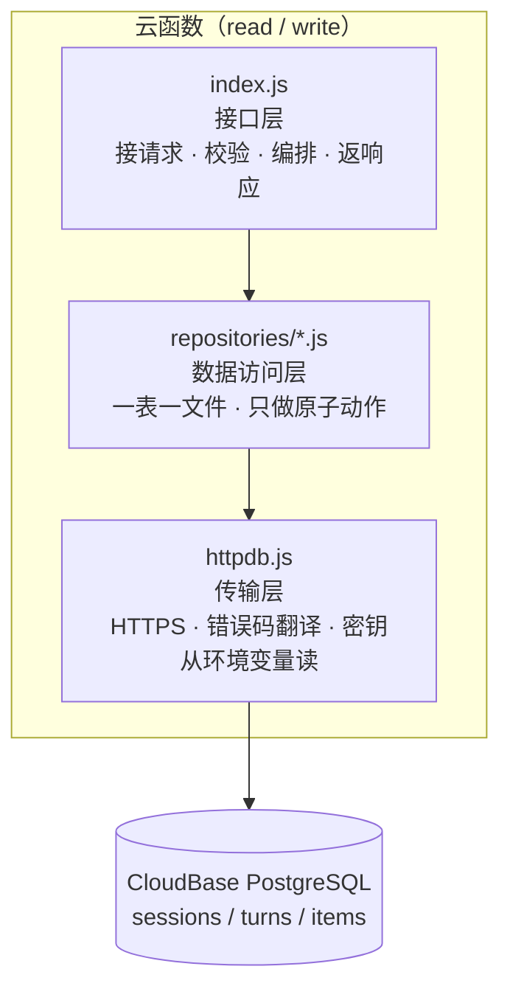

# 后端分层结构图（Day 19新增）

> 用途：给「后端代码分三层」这件事一个可对照的依据——
> 判断**新代码该放哪一层**，以及**重构时哪些测试会跟着失效**。
> 配套：`TECH_DESIGN.md §4.1`（目录结构，已按本次重构同步）、
> `docs/api-contract.md`（接口契约，字段与错误码以那里为准）。
> 本文只讲结构与依赖，**不含产品决策**；产品口径看 `PRD.md`。

---

## 一、三层职责与判据

| 层 | 文件 | 只回答什么问题 | 判据 |
|---|---|---|---|
| **接口层** | `index.js` | 这次请求该怎么处理、返回什么 | 换一个接口，这段代码**要不要改** |
| **数据访问层** | `repositories/*.js` | 对这张表做这一个动作 | 在任何接口里都一样 |
| **传输层** | `httpdb.js` | 怎么把请求送到数据库、错误码怎么翻 | 与业务无关 |

★ **判据一句话**：看**换一个需求时这段代码会不会跟着变**。
「取哪几列、按什么条件过滤」在任何接口里都一样 → 数据访问层；
「limit 只能是 1–100」是 HTTP 请求的规矩 → 接口层。

## 二、依赖方向（只能单向）



★ **反向依赖一律禁止**：

- `repositories/*.js` **不许** require `index.js`（会绕成环，模块加载直接死）
- `repositories/*.js` **不许**读`process.env` 以外的全局状态、不许发响应
- `index.js` 直接碰 `httpdb.js` 只允许两种用途：`db.classify`（错误怎么写进响应）
  与 `db.describe`（启动日志）。**数据一个都不经它手。**

## 三、文件与方法的对应

```
cloudfunctions/read/
├── index.js                    接口层：路由 · 参数校验 · shape*() 出口映射
├── httpdb.js                   传输层
└── repositories/
    ├── sessionsRepository.js   listSessions(topicId, limit)
    └── itemsRepository.js      listFavoritedItems(topicId, limit)

cloudfunctions/write/
├── index.js                    接口层：校验 · 编排（三步写入 + 补偿删除）· 响应
├── httpdb.js                   传输层
└── repositories/
    ├── sessionsRepository.js   buildSessionRow / insertSession / deleteBySessionId
    ├── turnsRepository.js      buildTurnRows / insertTurns
    └── itemsRepository.js      newItemId / buildItemRows / insertItems
```

### 三个刻意的安排

1. **`read` 不建 `turnsRepository.js`** —— read 一个 turn 都不查，
   建了就是空文件。凭空多一个空文件等于多一个要维护的东西。
2. **`chat` / `analyze` / `health` 一个 repository 都不建** —— 它们不碰数据库。
3. **read 与 write 各有一份 repository（内容有意不同）** ——
   CloudBase 每个云函数独立目录独立部署，`--dir cloudfunctions/read` 只打包那一个目录，
   放在仓库根的公共副本**不会被带上去**，部署后必然 `MODULE_NOT_FOUND`。
   真要共用只能改成分层或私有 npm 包，那是改部署方式。

## 四、两处边界最容易搞错

| 东西 | 放哪 | 为什么 |
|---|---|---|
| camelCase 映射（`shapeSession` / `shapeItem`） | **接口层** | 契约 §9.8 第 4 条：「映射只写在出口那一处」，出口即响应 |
| B7 / B8 硬约束（偏题 correction 必须 NULL、原句必须后端取回） | **接口层**（`cleanItems`） | 判据是**产品口径**不是数据库怎么存；让它依赖「写库那层心情好的时候才检查」是危险的——判错的后果是库里存进一句用户没说过的话 |
| snake_case 列名 | 数据访问层 | 那是库里的列名 |
| 时区处理（`iso()` / 拒绝非 +08:00 偏移） | 接口层 | 契约 §9.8 第 5 条：偏移量是写死的常量，出口只留一处 |

## 五、Day 19 回归清单

> 目的：证明「只是搬了代码，行为没变」。**重构前先抓响应存基线，重构后重抓逐字节对比。**
> 下面只记判定结果，不记具体数据 —— 基线文件含数据快照与域名，
> 写死会过时，所以不入库（`.gitignore` 已排除 `.workbuddy/`）。

### 判定分三档 —— 说清每条凭什么算「通过」

| 档 | 依据 | 适用 |
|---|---|---|
| **A 逐字节对比** | 重构前后 `cmp` 完全一致 | read / write 的 8 条响应 |
| **B 代码未动** | `git diff --name-only` 里根本没这个文件 | chat / analyze / health |
| **C 分支核对** | 逐条打错误分支，比对中文提示 | write 的 9 条校验路径 |

### A 档：逐字节对比（8 / 8 一致）

| # | 方法 | 路径 | 覆盖点 |
|---|---|---|---|
| 1 | `GET` | `/api/sessions?limit=100` | 正常读，全部主题 |
| 2 | `GET` | `/api/sessions?limit=100&topicId=T1` | 正常读，按主题过滤 |
| 3 | `GET` | `/api/favorites?limit=100` | 收藏列表（items 表） |
| 4 | `GET` | `/api/sessions?limit=0` | limit 越界 → 400 |
| 5 | `GET` | `/api/sessions?limit=100&topicId=T99` | topicId 白名单 → 400 |
| 6 | `GET` | `/api/nothing` | 未知路径 → 404 + `gotPath` |
| 7 | `POST` | `/api/sessions` | 方法不对 → 405 |
| 8 | `POST` | `/api/sessions/write`（非法 topicId） | 写接口参数校验 → 400 |

**复现命令**（基线在 `.workbuddy/baseline-day19/`，需重新抓一次）：

```bash
D="https://<envId>-<appId>.ap-shanghai.app.tcloudbase.com"
curl -s "$D/api/sessions?limit=100" -o .workbuddy/baseline-day19/01-sessions.json
# ……逐条抓完后，改完代码再抓一遍，然后：
for f in .workbuddy/baseline-day19/*.json; do
  cmp -s "$f" ".workbuddy/after-day19/$(basename $f)" \
    && echo "一致 $(basename $f)" || echo "不一致 $(basename $f)"
done
```

### B 档：代码未动（3 / 3）

| 对象 | 依据 | 结论 |
|---|---|---|
| `cloudfunctions/chat/` | `git diff --name-only` 无此路径 | 未部署未改动，行为必然不变 |
| `cloudfunctions/analyze/` | 同上 | 同上 |
| `cloudfunctions/health/` | 同上 | 同上 |
| `cloudbaserc.json` | 同上 | 接口路径与网关路由未动（契约不许动的要求守住了） |

### C 档：write 的 9 条校验分支（9 / 9）

| # | 场景 | 期望 | 实测 |
|---|---|---|---|
| 1 | 非法 JSON | `INVALID_JSON` | ✅ |
| 2 | 空请求体 | `INVALID_PARAMS`「缺少 topicId」 | ✅ |
| 3 | transcript 轮次跳号 | 「必须从 1 连续编号（缺了 turn=N）」 | ✅ |
| 4 | items 指向不存在的 turn | B8：「指向 turn=N，但 transcript 里没有这一轮」 | ✅ |
| 5 | logic 缺 correction | B7：「必须带 correction（改法）」 | ✅ |
| 6 | 时区写 `Z` | 「只接受 +08:00……相差 8 小时」 | ✅ |
| 7 | `isComplete` 与 `endedAt` 矛盾 | 「就必须给 endedAt」 | ✅ |
| 8 | `GET` 打 write 路径 | 405 + 「读列表请用 GET /api/sessions」 | ✅ |
| 9 | 未知子路径 | 404 + `gotPath` | ✅ |

★ 这 9 条**全是校验失败路径，一条都没落库** —— 回归后查库行数与回归前相同（已验证）。
这一点本身就是证据：校验层没被搬坏。

### write 成功路径

`turnsStored` / `itemsStored` / `itemsDropped` 三个计数、`errorCount`（只算偏题 + 逻辑错误）、
`goodSentenceCount`、重复提交返回 `400 DUPLICATE` —— 逐项与重构前一致。
验完清理测试数据，库回到回归前的行数（已验证）。

### 单测

| 文件 | 项数 | 备注 |
|---|---|---|
| `.test-write.js` | 118 / 0 | 重构前 100，**净增 18 项** |
| `.test-write-e2e.js` | 79 / 0 | 与重构前同数 |
| `.test-analyze.js` | 18 / 0 | 未动 |
| `.test-api-analyze.js` | 19 / 0 | 未动 |
| `.test-pending-transcript.js` | 33 / 0 | 未动 |
| `.test-transcript-turns.js` | 22 / 0 | 未动 |

## 六、拆文件时连带要改的东西（今天实际踩到的）

拆 repository 本身是搬代码，但有四处**不改就会红**，值得单独记：

1. **测试的注入点会失效**。`.test-write.js` 原靠「从 index.js 源码文本里 eval 抓纯函数」，
   `newItemId` 一搬走就抓不到，测试直接崩。改法：repository 是正常 CommonJS 模块，
   直接 `require` —— 比原来那份 eval 做法更干净。
2. **e2e 的副本法会失效**。它原把 index.js 复制到仓库根并替换 `require('./httpdb')`；
   拆出 `repositories/` 后副本在根目录解析不到 `./repositories/`，子进程直接起不来。
   改法：改成**整目录复制**，只覆盖 `httpdb.js` 为假模块，require 路径一个字不改。
   （逐个替换 require 要改四处，漏一处就变成「以为在测假库、其实连着真库」。）
3. **结构性 grep 判据会命中注释**。新加的「index.js 不再调 `db.insertMany`」第一次直接红 ——
   因为文件头那段记录搬迁的注释里就写着 `db.insertMany(`。
   **凡是结构性判据，先 `.replace(/\/\*[\s\S]*?\*\//g, '')` 剥注释再匹配。**
4. **判据只扫入口文件会把「搬走了」误判成「删掉了」**。
   「补偿删的是父表 sessions」原来在 index.js 里找 `deleteWhere('sessions'`，
   搬迁后失效 —— 正确做法是去 `repositories/sessionsRepository.js` 里找。
   同理，错误码扫描要**扫目录**（`readdirSync('repositories/')`）而不是扫两个固定文件。

★ 通用教训：**重构移动代码时，所有「在某个文件里找某段文本」的测试都要重新评估一遍**。
这类判据平时是优点（能钉住结构），重构时会成片失效。

